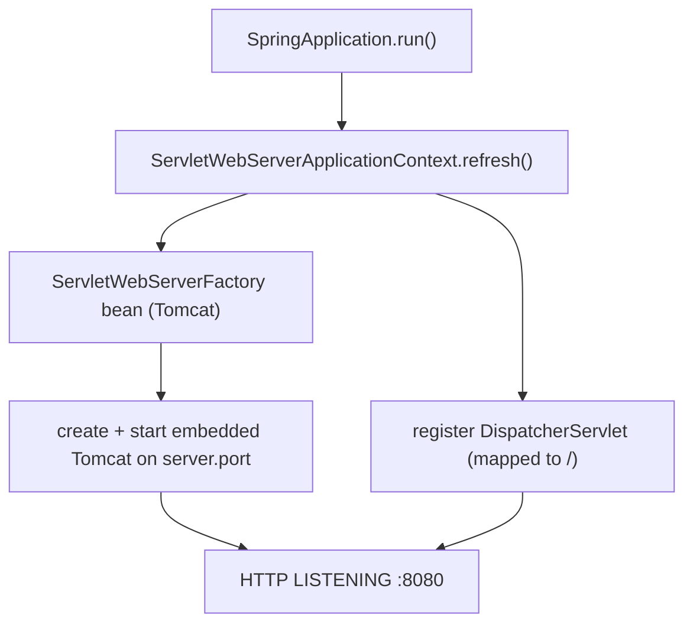

# 15 · Embedded Servers

> Boot flips the deployment model: instead of deploying a WAR *into* a servlet container you installed,
> the container is a **library inside your app**, started by `main()`. Understanding that inversion —
> and how the servlet stack is wired without a `web.xml` — is the last piece of Boot Core.
> [← Part 2 · Spring Boot Core](README.md) · prev: 14 · Externalized Configuration

> **Predict first (2 min).** A traditional app deploys `app.war` into a Tomcat you installed and
> manage separately. A Boot app runs `java -jar app.jar` and serves HTTP on `:8080`. Where did the
> web server come from, when did it start, and who registered the `DispatcherServlet` — there's no
> `web.xml`? Write your guess.

---

## The inversion: container-in-app, not app-in-container

Traditionally: you install Tomcat, drop a WAR into it, and the container owns the lifecycle and the
JVM. Boot inverts it — the prediction's answer: **the server is an ordinary dependency on your
classpath** (`spring-boot-starter-web` pulls in embedded Tomcat), and `SpringApplication.run()`
([ch.13](README.md)) **creates and starts it** as a bean during context refresh. Your app owns the
`main()`; the server is just something it starts.

Why this matters:
- **One artifact, self-contained.** `java -jar` runs anywhere with a JVM — no external container to
  install, version-match, or configure. Ideal for containers/Docker and 12-factor deploys.
- **Config is code/properties**, not container XML — `server.port`, `server.tomcat.*`, TLS, threads
  all bind from the `Environment` ([ch.14](README.md)).
- **Dev/prod parity** — the server you run locally *is* the one in prod.

## Which server, and how you swap it

`spring-boot-starter-web` defaults to **embedded Tomcat**. Swap by excluding it and adding another
starter:

| Server | How | Model |
|---|---|---|
| **Tomcat** (default) | `spring-boot-starter-web` | thread-per-request (servlet) |
| **Jetty** | exclude Tomcat, add `spring-boot-starter-jetty` | thread-per-request (servlet) |
| **Undertow** | exclude Tomcat, add `spring-boot-starter-undertow` | thread-per-request (servlet) |
| **Netty** | `spring-boot-starter-webflux` (no MVC) | event-loop, non-blocking ([Part 3](../03-web-mvc-and-reactive/)) |

⚡ **Servlet vs reactive is a fork, not a flag:** `-web` (Tomcat + Spring MVC, blocking, thread-per-
request) vs `-webflux` (Netty + WebFlux, non-blocking event loop). Don't put both on the classpath
expecting a toggle — pick the stack.

## How the servlet stack gets wired without web.xml

The other half of the prediction: **no `web.xml`.** Boot's `ServletWebServerApplicationContext`
(the web variant of the container) does two things during `refresh()`:

1. Finds the **`ServletWebServerFactory`** bean (auto-configured — `TomcatServletWebServerFactory`)
   and calls it to **create + start** the embedded server.
2. Registers servlets/filters programmatically. The **`DispatcherServlet`** is auto-configured
   (`DispatcherServletAutoConfiguration`) and registered — mapped to `/` by default. Extra servlets
   go via `ServletRegistrationBean`/`FilterRegistrationBean` beans, replacing `web.xml` entries.

So the server flips to **LISTENING inside `refresh()`** — before `run()` returns and before your
`ApplicationRunner`s fire ([ch.13](README.md)).

## The knobs that matter in production

- **Thread pool (servlet):** `server.tomcat.threads.max` (default 200) — the ceiling on concurrent
  blocking requests. Under blocking I/O this, not CPU, is usually your concurrency limit; pair it
  with the DB pool ceiling ([ch.23](../04-data-and-transactions/)). Virtual threads
  (`spring.threads.virtual.enabled=true`, Boot 3.2+ on Java 21) relax this by unmounting blocked
  request threads ([java ch.19](../../java/03-concurrency-and-jmm/)).
- **Graceful shutdown:** `server.shutdown=graceful` — stop accepting new requests, let in-flight ones
  finish within `spring.lifecycle.timeout-per-shutdown-phase`. Essential behind a rolling deploy/LB.
- **Connection/timeouts:** `server.tomcat.connection-timeout`, `max-connections`, `accept-count`
  (backlog). ⚡ **Port 0** = pick a random free port (great for tests — inject `@LocalServerPort`).
- **Still need a WAR?** You can (`war` packaging + extend `SpringBootServletInitializer`) for a
  legacy shared container — but the default and recommended path is the executable jar
  ([ch.27](../05-production/)).

## Make it visible

- **Prove it's embedded.** `java -jar app.jar` with no Tomcat installed → `curl :8080` works. Then
  `jar tf app.jar | grep tomcat` — the server classes are *inside* your artifact.
- **Swap the server.** Exclude Tomcat, add `starter-undertow`, restart — same app, startup log now
  says Undertow. No code change.
- **Random port in a test.** `@SpringBootTest(webEnvironment = RANDOM_PORT)` + `@LocalServerPort` —
  see the OS-assigned port; `server.port=0` at work.
- **Graceful shutdown.** Set `server.shutdown=graceful`, hold a slow request, `kill` the process —
  watch it drain instead of dropping the request.

## Self-Check (close the doc, answer out loud)

1. What's the deployment-model inversion Boot makes, and what are two concrete benefits?
2. Where does the web server come from and *when* does it start relative to `run()` returning?
3. Who registers the `DispatcherServlet` now that there's no `web.xml`?
4. How do you switch from Tomcat to Undertow or to Netty — and why isn't servlet-vs-reactive just a flag?
5. Name three production server settings and why each matters (think concurrency, deploys, tests).

> **Go deeper:** the Boot reference → "Embedded Web Servers" and "Graceful Shutdown"; then
> [Part 3 · Web MVC & Reactive](../03-web-mvc-and-reactive/) for what happens *inside* the
> `DispatcherServlet` once a request arrives. 🎉 This completes **Part 2 · Spring Boot Core**.
