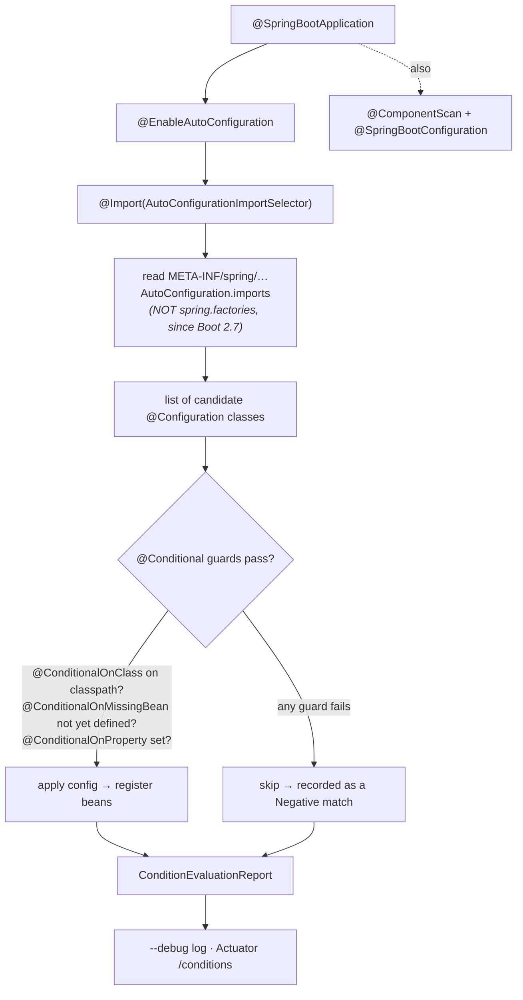

# Part 2 · Spring Boot Core

> Part 0 put the container in your hands and Part 1 showed you the hooks it extends through. This is
> where "Boot" finally earns its name: opinionated defaults, starters, **auto-configuration**, an
> embedded server, and externalized config. The promise of this part is simple and load-bearing for
> everything after — **none of it is magic.**
> [← curriculum index](../README.md)

This is the heart of "Spring Boot internals." Everything people *mean* when they say a Boot app
"just works" lives in these six chapters, and almost all of it reduces to one mechanism:
**auto-configuration is a pile of ordinary `@Configuration` classes guarded by `@Conditional`
checks, evaluated in a defined order.** The single skill this part builds — the one that separates
the engineer who *uses* Boot from the one who *operates* it — is **debugging "why is (or isn't) this
bean here?" by reading the condition evaluation report instead of guessing.**

---

## Learning objectives — what "I know this" actually means

By the end of this part you can, **from memory and out loud**:

- Explain **what Boot adds over plain Spring** without hand-waving: opinionated dependency
  management (starters + a BOM), auto-configuration, an embedded server, externalized config with a
  defined precedence, and production-readiness (Actuator) — and say that *every one of those is
  still just beans in the container you learned in Part 0.*
- Expand **`@SpringBootApplication`** into its three composed annotations — `@SpringBootConfiguration`
  (itself a `@Configuration`), `@EnableAutoConfiguration`, and `@ComponentScan` — and explain what
  each contributes.
- Trace auto-configuration **end to end**: `@EnableAutoConfiguration` imports
  `AutoConfigurationImportSelector`, which (Boot 2.7+ and all of 3.x) reads candidate classes from
  `META-INF/spring/org.springframework.boot.autoconfigure.AutoConfiguration.imports` — **not** the
  legacy `META-INF/spring.factories` — then each candidate is gated by the **`@Conditional` family**
  (`@ConditionalOnClass`, `@ConditionalOnMissingBean`, `@ConditionalOnProperty`, `@ConditionalOnBean`,
  …), ordered with `@AutoConfiguration(before/after)` / `@AutoConfigureOrder`.
- Name **`@ConditionalOnMissingBean` as the override mechanism** — the reason defining your own bean
  makes the auto-configured default quietly *back off* — and explain why that makes Boot defaults
  "suggestions, not commands."
- Explain how a **starter** wires a feature: it is a (mostly) dependency-only POM that pulls the
  libraries + their auto-config jars onto the classpath, with versions pinned by the
  `spring-boot-dependencies` **BOM**, so `@ConditionalOnClass` then fires.
- Recite the **`SpringApplication.run()` sequence** and say **exactly where the embedded server
  boots** — inside `refreshContext()`, in `onRefresh()`.
- State the **externalized-configuration precedence** (command-line args → `SPRING_APPLICATION_JSON`
  → OS env / system properties → profile-specific files → `application.properties|yml` → defaults)
  and what **relaxed binding** maps together (`my.app-name` ≡ `MY_APP_NAME` ≡ `myAppName`).
- Explain that the embedded server is created by a **`WebServerFactory`** (Tomcat by default; swap
  to Jetty/Undertow, or Reactor Netty for WebFlux) — itself an auto-configured bean.

## Topic checklist

- [ ] **10 · What Boot Adds: Opinions, Starters & the Philosophy** — the five things Boot layers on
      top of Spring (dependency management, auto-config, embedded server, externalized config,
      production-readiness) and the *philosophy* behind them: **convention over configuration**,
      **sensible defaults you can always override**, and "make the 90% case zero-config without
      taking the 10% case away." Why Boot is *not* a new framework — it's plain Spring plus opinions,
      so everything from Part 0 still applies underneath.
- [ ] **11 · Auto-Configuration Internals** — the chapter the whole part orbits.
      `@SpringBootApplication` = `@SpringBootConfiguration` + `@EnableAutoConfiguration` +
      `@ComponentScan`; `@EnableAutoConfiguration` → `@Import(AutoConfigurationImportSelector.class)`
      → it reads `AutoConfiguration.imports` (Boot 2.7+/3.x; **not** `spring.factories`) → each
      candidate runs as a `@Configuration` **only if its `@Conditional` guards pass**; the
      `@Conditional` family; **ordering** (`@AutoConfiguration(after=…)`); and
      **`@ConditionalOnMissingBean`** as the back-off / override mechanism. Crucially: it is all
      *visible* — `--debug` prints the `ConditionEvaluationReport`; Actuator's `/conditions` serves
      it as JSON.
- [ ] **12 · Starters & Dependency Management** — a starter (`spring-boot-starter-web`,
      `-data-jpa`, …) is a curated, transitive dependency set, *not* code; the
      `spring-boot-dependencies` **BOM** pins every version so you don't specify them; the
      `spring-boot-starter-parent` (or the dependency-management plugin) imports that BOM; how
      adding a starter puts classes on the classpath that flip `@ConditionalOnClass` and *trigger*
      the matching auto-config. Writing your **own** starter (`*-spring-boot-starter` +
      `*-spring-boot-autoconfigure`).
- [ ] **13 · The SpringApplication Startup Sequence** — `SpringApplication.run()` step by step:
      deduce the **web application type** (none / servlet / reactive) from the classpath →
      `SpringApplicationRunListeners` (the `starting` event) → prepare the `Environment` (config
      loads here) → print the banner → **create** the right `ApplicationContext` → `prepareContext`
      (apply initializers, register the primary source) → **`refreshContext`** (this calls
      `AbstractApplicationContext.refresh()` from Part 0 — **the embedded server boots inside it, in
      `onRefresh`**) → `afterRefresh` → fire `ApplicationRunner`/`CommandLineRunner` beans → the
      `ready` event.
- [ ] **14 · Externalized Configuration & Relaxed Binding** — `application.properties` / `.yml`,
      **profiles** (`application-{profile}.yml`, `@Profile`, `spring.profiles.active`), the full
      **property-source precedence** order, `@ConfigurationProperties` type-safe binding (preferred
      over scattered `@Value`), `@Value` and SpEL, and **relaxed binding** (kebab/camel/underscore/
      env-var forms all map to the same property). The Boot 2.4+ config-data loading model
      (`spring.config.import`, profile groups).
- [ ] **15 · Embedded Servers** — why Boot ships the server *inside* the app (one self-contained
      artifact, no external Tomcat to install) instead of producing a WAR; the
      **`WebServerFactory`**/`WebServer` abstraction; **Tomcat is the servlet default**, with Jetty
      and Undertow as drop-in swaps (exclude one starter, add another); **Reactor Netty** for the
      reactive (WebFlux) stack; where the server is created (in `onRefresh` of the web context) and
      how the port/threads are configured (`server.*`). Sets up Part 3's `DispatcherServlet`.

## The principal-level insight

**Auto-configuration is not magic — it is a pile of ordinary `@Configuration` classes guarded by
`@Conditional` checks, evaluated in a defined order, every one of which Boot will explain to you on
request.** Internalize that sentence and the whole "Boot does things behind my back" anxiety
evaporates. There is no behind-your-back: there is a list of candidate configuration classes (from
`AutoConfiguration.imports`), each with explicit, *inspectable* preconditions — "is this class on
the classpath?" (`@ConditionalOnClass`), "did the developer already define this bean?"
(`@ConditionalOnMissingBean`), "is this property set?" (`@ConditionalOnProperty`) — and a defined
evaluation order so that, say, the DataSource is configured before the JPA `EntityManagerFactory`
that depends on it.

The senior asks "why did Boot create a `DataSource`?" and reaches for a blog post. The **principal
asks the same question and runs the app with `--debug`** (or hits Actuator `/conditions`), reads the
**positive matches** ("`DataSourceAutoConfiguration` matched: found class `javax.sql.DataSource`,
no `DataSource` bean already defined") and the **negative matches** ("`DataSourceAutoConfiguration`
did not match: `@ConditionalOnClass` did not find `com.zaxxer.hikari.HikariDataSource`"), and *knows*
the answer instead of guessing it. That report is the ground truth; everything else is folklore.
The corollary is the override model: because the default DataSource is `@ConditionalOnMissingBean`,
the moment you declare your own `DataSource` `@Bean`, the auto-configured one **backs off** — and
the report will tell you it backed off and exactly which of your beans displaced it. You don't fight
Boot's opinions; you state your own, and Boot's conditionals defer.

## Drills (build, don't just read)

Spring's superpower — the analog of the [`../../java/`](../../java/) track's *"measure it on a real
JVM"* — is that the container **makes the invisible visible**. Auto-config is the most "magical"
thing in Boot and therefore the most rewarding to interrogate. Do these in a throwaway Boot app, not
in your head.

1. **Read the condition report and explain a bean.** Add `spring-boot-starter-web` and run with
   `--debug` (or set `logging.level…` and hit Actuator `/conditions`). Find `Tomcat` /
   `DispatcherServletAutoConfiguration` in the **Positive matches** and read the exact conditions
   that fired. Then pick one bean you *didn't* write and trace, from the report alone, the chain of
   `@ConditionalOnClass`/`@ConditionalOnMissingBean` that put it there. State it out loud. This drill
   ends the "magic" framing permanently.
2. **Override and watch the default back off.** Let Boot auto-configure something
   (`ObjectMapper`, `DataSource`, or a `RestClient.Builder`). Note it in the report. Now define your
   own `@Bean` of that type and re-run: confirm in the report that the auto-configured one moved to
   **Negative matches / "Bean already defined"** and *yours* is now in the context. You just proved
   `@ConditionalOnMissingBean` is the override mechanism — by observation, not belief.
3. **Trace `SpringApplication.run()` with a breakpoint.** Set breakpoints in
   `SpringApplication.run`, `prepareContext`, `refreshContext`, and
   `ServletWebServerApplicationContext.onRefresh` (or step into `AbstractApplicationContext.refresh`).
   Walk the sequence and **watch the embedded Tomcat start inside `onRefresh`** — *before* your
   `CommandLineRunner` fires. Reconcile the call stack against the sequence in chapter 13 until there
   are no surprises.
4. **Override one property four ways.** Set the same property (e.g. `server.port`) in
   `application.yml`, then a profile-specific file, then an OS environment variable
   (`SERVER_PORT=…`, proving relaxed binding too), then a command-line arg (`--server.port=…`). Run
   each and observe which wins. Reconstruct the full precedence order from what you saw, then check
   it against the reference. The env-var form winning over the file teaches relaxed binding for free.
5. **Swap the embedded server.** In a `-starter-web` app, exclude `spring-boot-starter-tomcat` and
   add `spring-boot-starter-undertow` (or Jetty). Change *no code*. Restart and confirm from the
   startup log and the condition report that a different `WebServerFactory` is now active. Reflect on
   why this required zero application changes — the `WebServerFactory`/`WebServer` abstraction and a
   classpath-driven `@Conditional` did all the work.

## Interview lens

This part *is* the Spring Boot interview. The questions are predictable and the depth of your answer
is the whole signal. **"How does auto-configuration work?"** — the weak answer says "Boot
auto-configures things"; the strong answer says "`@EnableAutoConfiguration` imports
`AutoConfigurationImportSelector`, which reads candidate `@Configuration` classes from
`AutoConfiguration.imports`, each gated by `@Conditional` and evaluated in a defined order, with
`@ConditionalOnMissingBean` letting my beans override the defaults." **"What does
`@SpringBootApplication` expand to?"** — `@SpringBootConfiguration` + `@EnableAutoConfiguration` +
`@ComponentScan`; bonus points for noting `@SpringBootConfiguration` is itself a `@Configuration` and
that scanning defaults to the annotated class's package. **"How would you debug a bean that should
(or shouldn't) be created?"** — the single best discriminator: the principal *immediately* reaches
for `--debug` / the `ConditionEvaluationReport` / Actuator `/conditions`, not for trial-and-error.
**"How does an embedded server get started?"** — a `WebServerFactory` bean (auto-configured,
classpath-driven; Tomcat by default) creates a `WebServer` inside `onRefresh` during
`refreshContext`. **"What's the config property precedence?"** — command-line args win, files lose,
profiles and env vars sit in between; relaxed binding unifies the naming. Reaching for the condition
report unprompted is the tell that you *operate* Boot rather than merely use it.

## How auto-configuration actually fires

Read it as one sentence: the annotation imports a selector, the selector reads a flat list of
candidate config classes off the classpath, each candidate is kept or dropped by explicit
conditionals, and the **kept/dropped decision for every one is recorded in a report you can print.**
That report is where a principal starts every "why is this here?" investigation.

## Visualizations

See [`visualizations/`](visualizations/) for this part's animations — **`autoconfig-conditions`**
(candidate configuration classes flowing through the `@Conditional` gates, each lighting up green as
a positive match or red as a negative one, then assembling into the `ConditionEvaluationReport`),
and **`springapplication-run`** (the `SpringApplication.run()` timeline — deduce web type → run
listeners → prepare environment → create context → `prepareContext` → `refreshContext` with the
embedded server visibly booting inside `onRefresh` → runners fire → `ready`). Full philosophy and
catalog in [VISUALIZATIONS.md](../VISUALIZATIONS.md).
