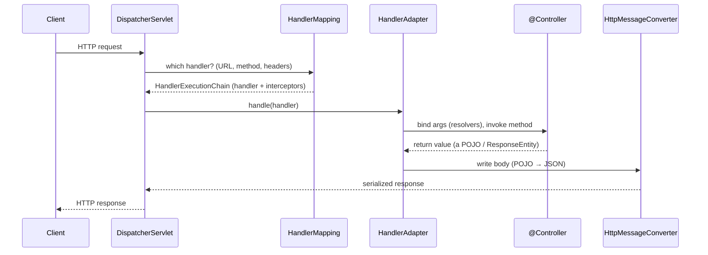

# 16 · Spring MVC Internals: the DispatcherServlet

> How one HTTP request becomes a response — the **front controller** and its pipeline of strategy
> interfaces (`HandlerMapping` → `HandlerAdapter` → resolvers → converters). Once you can name each
> stage, every 404 / won't-deserialize / validation-didn't-fire becomes a *specific* stage to inspect.
> [← Part 3 · Web: MVC, REST & Reactive](README.md) · next: 17 · Building REST APIs

> **Predict first (2 min).** When a JSON `POST` hits `@PostMapping ... @RequestBody Order o`, what
> component turns the JSON body into an `Order`, and what turns the returned `Order` back into a JSON
> response? Write your guesses.

---

## One front controller, a pipeline of strategies

Every request funnels through a single servlet — the **`DispatcherServlet`** — whose `doDispatch()`
orchestrates a fixed pipeline of pluggable **strategy interfaces**:

> ▶ **Watch it:** [`dispatcherservlet-flow.html`](visualizations/dispatcherservlet-flow.html) — a
> request stepping through each stage, the payload transforming request → handler → object → JSON.

So the prediction resolves: an **`HttpMessageConverter`** (Jackson's `MappingJackson2HttpMessageConverter`
for JSON) does *both* — reads the request body into your `@RequestBody Order`, and writes the returned
`Order` back to JSON for `@ResponseBody`. Content type decides which converter (via `Content-Type` /
`Accept`).

---

## The stages (name them — this is the whole chapter)

1. **`HandlerMapping`** — maps the request (URL + method + headers) to a handler.
   `RequestMappingHandlerMapping` resolves your `@RequestMapping`/`@GetMapping` methods. No match → **404**.
2. **`HandlerAdapter`** — knows how to *invoke* that handler. `RequestMappingHandlerAdapter` runs the
   annotated-controller machinery:
   - **`HandlerInterceptor.preHandle`** (cross-cutting: auth checks, timing, MDC).
   - **`HandlerMethodArgumentResolver`s** — bind each parameter: `@PathVariable`, `@RequestParam`,
     `@RequestHeader`, `@RequestBody` (→ `HttpMessageConverter`), `@Valid` triggers **Bean Validation**
     (fail → 400). ⚡ a missing/mismatched resolver is why an argument is null or a body won't bind.
   - invoke your **controller method**.
   - **`HandlerMethodReturnValueHandler`s** — process the return: `@ResponseBody`/`ResponseEntity` →
     `HttpMessageConverter` writes the body; a `String`/`ModelAndView` → **`ViewResolver`** renders a view.
   - **`HandlerInterceptor.postHandle` / `afterCompletion`**.
3. **`HandlerExceptionResolver`** — if anything threw, this handles it: `@ExceptionHandler` /
   `@ControllerAdvice` map exceptions to responses (→ `ProblemDetail`, [chapter 17](README.md)).

**Threading:** the servlet stack is **blocking, thread-per-request** — one thread carries the whole
request. (Boot 3.2+ can run these on **virtual threads** — [chapter 19](README.md) — so blocking is cheap.)

---

## `Filter` vs `HandlerInterceptor` (a classic confusion)

- **Servlet `Filter`** — container-level, wraps the *raw* request/response *before* the
  `DispatcherServlet` (Spring Security lives here — [chapter 24](../05-production/)). Sees everything,
  knows nothing about handlers.
- **`HandlerInterceptor`** — Spring-level, *inside* the dispatcher, around a *resolved handler*
  (has `pre/postHandle`). Use it when you need handler context; use a `Filter` for truly cross-cutting
  request wrapping.

---

## Make it visible

- **Every URL → handler.** `/actuator/mappings` lists every mapping and the controller method it
  resolves to — the `HandlerMapping` table, dumped. First stop for a mystery 404.
- **Breakpoint the pipeline.** Set one in **`DispatcherServlet.doDispatch`** and step: watch
  `getHandler` → `getHandlerAdapter` → `preHandle` → invoke → return-value handling → `render`.
- **Trace it.** `logging.level.org.springframework.web=DEBUG` (or `...servlet=TRACE`) narrates the
  chosen handler, the argument binding, and the converter used.

---

## Self-Check (close the doc, answer out loud)

1. What is the `DispatcherServlet` and what does `doDispatch` orchestrate? Name the stages in order.
2. What does `HandlerMapping` do vs `HandlerAdapter`? What produces a 404?
3. Which component deserializes `@RequestBody` and serializes `@ResponseBody`, and how is it chosen?
4. Where do `@Valid` validation and `@ExceptionHandler` fit in the pipeline?
5. Servlet `Filter` vs `HandlerInterceptor` — where does each run, and when do you pick which?
6. A `@RequestBody` param is arriving null / a route 404s — which stage and which Actuator endpoint
   do you check first?

> **Go deeper:** read `DispatcherServlet.doDispatch` and `RequestMappingHandlerAdapter` in the source;
> the reference → "Web MVC · DispatcherServlet"; then [17 · Building REST APIs](README.md) and
> [18 · WebFlux & Reactive](README.md) for the non-blocking analog.
