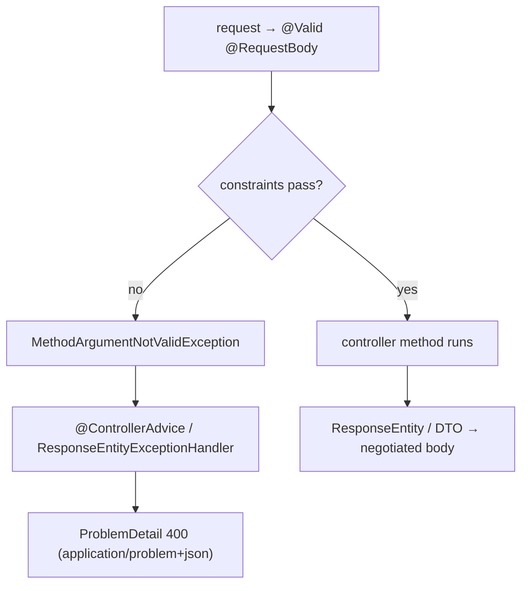

# 17 · Building REST APIs: Negotiation, Errors & Validation

> Once a request reaches your controller ([ch.16](README.md)), three things decide the quality of your
> API: how the response format is **negotiated**, how inputs are **validated**, and how failures become
> **consistent error bodies**. Boot 3 has opinions on all three.
> [← Part 3 · Web MVC & Reactive](README.md) · prev: 16 · DispatcherServlet Internals · next: 18 · WebFlux & Reactive

> **Predict first (2 min).** A client POSTs JSON with a blank `name` to your `@Valid`-annotated
> endpoint. Where does the validation run, what exception is thrown, and what HTTP status does the
> client get *by default* — 400, 422, or 500? Write your guess.

---

## `@RestController` and content negotiation

`@RestController` = `@Controller` + `@ResponseBody` — every handler's return value is **serialized
into the response body** (not resolved as a view). *Which* serializer runs is **content negotiation**:

- The client's **`Accept`** header (e.g. `application/json`) selects an **`HttpMessageConverter`**;
  Boot auto-configures Jackson for JSON. Request bodies use **`Content-Type`** the same way to pick a
  converter for `@RequestBody`.
- Return a plain object → 200 + serialized body. Need explicit control over **status/headers**? Return
  **`ResponseEntity<T>`** (`ResponseEntity.created(uri).body(dto)`, `.status(404).build()`).
- ⚡ Status-code discipline: 201 + `Location` for creation, 204 for empty success, 400 client input,
  404 missing, 409 conflict, 422 semantic-validation. **"200 with an error field" is a smell** — it
  forces every client to parse the body to learn if the call succeeded; use the status line.

## Bean Validation: `@Valid` and how a violation becomes a 400

The prediction's core. Annotate the request object's fields with **`jakarta.validation`** constraints
(`@NotBlank`, `@Email`, `@Size`, `@Min`…), then `@Valid` on the parameter triggers validation
**before your method body runs**:

```java
public record CreateUser(@NotBlank String name, @Email String email, @Min(18) int age) {}

@PostMapping("/users")
ResponseEntity<UserDto> create(@Valid @RequestBody CreateUser req) { … }   // body only runs if valid
```

- A failed `@RequestBody` validation throws **`MethodArgumentNotValidException`**; on `@Validated`
  method params / path-query args it's `ConstraintViolationException`. The prediction's answer:
  Spring MVC maps `MethodArgumentNotValidException` to **HTTP 400** by default (not 500 — it's client
  error; and not 422 unless you choose it).
- ⚡ **`@Valid` vs `@Validated`:** `@Valid` (JSR-380) triggers cascade validation on a bean/param;
  `@Validated` (Spring) additionally enables **validation groups** and method-level validation on a
  bean. Use `@Valid` on `@RequestBody`; `@Validated` on the class for param/group validation.
- ⚡ **Cascade:** `@Valid` on a nested field validates the nested object too — otherwise nested
  constraints are silently skipped.

## Centralized errors: `@ControllerAdvice` + `ProblemDetail` (RFC 7807)

Scattering `try/catch` in controllers is the anti-pattern. Centralize with a
**`@ControllerAdvice`** (or `@RestControllerAdvice`) bean holding **`@ExceptionHandler`** methods —
one place that turns any exception into a proper response:

```java
@RestControllerAdvice
class ApiErrors {
  @ExceptionHandler(EntityNotFoundException.class)
  ProblemDetail notFound(EntityNotFoundException e) {
    var pd = ProblemDetail.forStatusAndDetail(HttpStatus.NOT_FOUND, e.getMessage());
    pd.setType(URI.create("https://api.example.com/errors/not-found"));
    return pd;   // serialized as application/problem+json
  }
}
```

- **`ProblemDetail` / RFC 7807** is **Boot 3's standard error format** — a documented JSON shape
  (`type`, `title`, `status`, `detail`, `instance`) served as `application/problem+json`, so every
  error looks the same and clients can parse it uniformly.
- ⚡ Boot's **`ResponseEntityExceptionHandler`** already emits `ProblemDetail` for Spring's own
  exceptions (including `MethodArgumentNotValidException`) — extend it to customize, and add handlers
  for *your* domain exceptions. Enable with `spring.mvc.problemdetails.enabled=true` (or by extending
  the base handler).



## Make it visible

- **Watch negotiation.** Hit the same endpoint with `Accept: application/json` vs
  `application/xml` (add the XML converter) — the body format flips with no controller change.
- **Trigger a 400.** POST an invalid `@Valid` body; observe **400** with a `ProblemDetail`
  listing the field errors — and confirm your controller body never ran (log at its first line).
- **Centralize an error.** Throw a domain `EntityNotFoundException`; without advice it's a 500, with
  a `@RestControllerAdvice` handler it's a clean **404 `problem+json`**. Same exception, different
  contract.

## Self-Check (close the doc, answer out loud)

1. What is `@RestController` shorthand for, and how is the response format chosen?
2. When does `@Valid` run relative to your method body, and what exception/status does a bad `@RequestBody` produce by default?
3. `@Valid` vs `@Validated` — what does each add, and where do you put each?
4. What is `ProblemDetail`/RFC 7807, and what does Boot already do for Spring's own exceptions?
5. Why is "HTTP 200 with an error field in the body" a smell?

> **Go deeper:** the Spring reference → "Validation" and "Error Responses / ProblemDetail"; RFC 7807;
> then [18 · WebFlux & Reactive](README.md) — the non-blocking counterpart to everything in this part.
