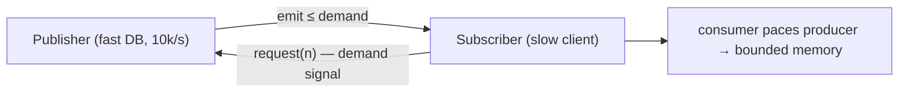

# 18 · WebFlux & Reactive (Reactor, Backpressure, When to Use)

> WebFlux is a *different concurrency model*, not a faster one. It trades thread-per-request blocking
> for a small non-blocking event loop — a win for high-concurrency I/O-bound services, a footgun the
> moment one blocking call sneaks into the chain.
> [← Part 3 · Web MVC & Reactive](README.md) · prev: 17 · Building REST APIs · next: 19 · Filters, Interceptors & the Stacks

> **Predict first (2 min).** A WebFlux handler returns a `Flux<Item>` but does nothing else — no
> `.subscribe()`. Does the database query run? And separately: a fast DB streams 10,000 rows/s into a
> slow WebSocket client — what stops memory from exploding? Write your guesses.

---

## The model: event loop, not thread-per-request

Servlet MVC ([ch.16](README.md)) dedicates a **thread per request**; a blocking call (DB, HTTP) parks
that thread until it returns. WebFlux instead runs on a **small fixed pool of event-loop threads**
(default server **Reactor Netty**): a handler returns *immediately* with a **publisher** describing
future work, and the event loop moves on. When I/O completes, a callback resumes the pipeline. Few
threads serve enormous concurrency — *as long as nothing blocks them.*

- Front controller is **`DispatcherHandler`** (the reactive analog of `DispatcherServlet`); handlers
  are annotated `@Controller` **or** functional `RouterFunction`s.
- HTTP client is the non-blocking **`WebClient`** (not `RestTemplate`).

## Reactor: `Mono`, `Flux`, and *laziness*

Spring's reactive types come from **Project Reactor**:

- **`Mono<T>`** — 0 or 1 element (a single result / completion).
- **`Flux<T>`** — 0..N elements (a stream).

Both are **lazy publishers**: building a pipeline (`.map`, `.filter`, `.flatMap`) does **nothing** —
it just *describes* work. The prediction's first answer: **the query does not run** until something
**subscribes**. In WebFlux the framework subscribes when the response is written; if you build a
`Mono` and never return/subscribe it, its side effects never happen — the #1 reactive beginner bug
("my `save()` didn't save").

```java
@GetMapping("/items")
Flux<Item> items() {
  return repo.findAll()          // returns a Flux — NOTHING runs yet
             .filter(Item::active)
             .map(Item::toDto);  // still just a description; framework subscribes to stream it
}
```

## Backpressure: the consumer sets the pace

The prediction's second answer — **backpressure**. A `Subscriber` signals **demand** upstream via
`request(n)`: "send me at most n more." A fast producer **cannot** push faster than the consumer
pulls; when demand is 0, the producer must wait, buffer (bounded), or drop per the chosen strategy.
That flow-control is what keeps a fast DB from overwhelming a slow client and blowing up memory —
the defining feature of *reactive streams* vs plain callbacks.



- Strategies when a producer outruns demand: **buffer** (bounded), **drop**, **latest**, or **error**
  (`onBackpressureBuffer/Drop/Latest/Error`). Choosing one is a deliberate call, not a default to ignore.

## The cardinal rule — and when to actually use WebFlux

⚡ **One blocking call anywhere in the chain poisons the event loop.** A `Thread.sleep`, a JDBC call,
a blocking HTTP client on an event-loop thread stalls *every* request that thread was multiplexing.
If you must call blocking code, isolate it on a bounded scheduler (`subscribeOn(Schedulers.boundedElastic())`)
— but at that point question whether reactive is buying you anything.

**Use WebFlux when:** very high concurrency of **I/O-bound** work, streaming (SSE/WebSocket), or a
fully non-blocking stack (R2DBC, `WebClient`) end-to-end. **Don't** when: your data access is blocking
JDBC/JPA, the team isn't fluent in Reactor (debugging stack traces are brutal), or load is modest —
plain MVC is simpler and, on **virtual threads** ([ch.15](../02-spring-boot-core/),
[java ch.19](../../java/03-concurrency-and-jmm/)), now gets much of the scalability *without* the
programming-model tax. Reactive is a concurrency model, **not a speed dial**.

## Make it visible

- **Prove laziness.** Build a `Flux` with a `.doOnNext(System.out::println)` but never subscribe —
  nothing prints. Add `.subscribe()` (or return it from a handler) — now it runs.
- **See backpressure.** `Flux.range(1, 1_000_000).log()` with a slow subscriber that `request(1)`s at
  a time — the `log()` shows `request(1)` signals gating emission; the producer never races ahead.
- **Poison the loop (in a test).** Put a `Thread.sleep(1000)` in a WebFlux handler and watch a handful
  of concurrent requests serialize/stall — then move it to `boundedElastic()` and watch them recover.

## Self-Check (close the doc, answer out loud)

1. How does WebFlux's threading differ from servlet MVC, and what's the default server?
2. `Mono` vs `Flux`, and what does "lazy publisher" mean for when your code actually runs?
3. What is backpressure mechanically (who signals whom), and what problem does it solve?
4. What's the cardinal rule about blocking, and how do you quarantine a blocking call if forced to?
5. When is WebFlux the right call — and why do virtual threads change that calculus?

> **Go deeper:** Project Reactor reference & the marble diagrams; the Spring WebFlux reference;
> "Reactive vs Virtual Threads" talks; then [19 · Filters, Interceptors & the Stacks](README.md),
> which contrasts the servlet and reactive request pipelines directly.
