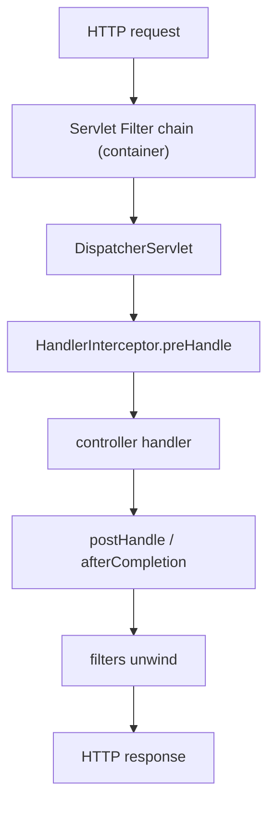

# 19 · Filters, Interceptors, the Stacks & Virtual Threads

> Two ways to wrap request handling — the container-level **`Filter`** and the Spring-level
> **`HandlerInterceptor`** — sit at different depths and see different things. Knowing which is which
> (and that Boot 3.2 virtual threads make plain blocking MVC scale) closes Part 3.
> [← Part 3 · Web MVC & Reactive](README.md) · prev: 18 · WebFlux & Reactive

> **Predict first (2 min).** A request is rejected by Spring Security before it ever reaches your
> controller. Was that a `Filter` or a `HandlerInterceptor`? And: which of the two can see *which
> handler method* is about to run? Write your guesses.

---

## Two interception points, at different depths

A request passes through layers before (and after) your controller. Two extension points wrap it:

| | **`Filter`** (Servlet) | **`HandlerInterceptor`** (Spring MVC) |
|---|---|---|
| Level | **Servlet container** — outside the `DispatcherServlet` | **Inside** the dispatch, around the handler |
| Sees | raw `ServletRequest`/`Response`, the whole chain | the resolved **handler** (`preHandle`/`postHandle`/`afterCompletion`), `ModelAndView` |
| Can | short-circuit before Spring even runs; wrap req/resp | run logic knowing the target handler; tie into MVC lifecycle |
| Registered | `@Component Filter` / `FilterRegistrationBean` | `WebMvcConfigurer.addInterceptors` |

The prediction's answers: Security rejects at the **`Filter`** level (see below), *before* dispatch —
so it's a filter. And only the **`HandlerInterceptor`** knows *which handler* is about to run
(`preHandle(request, response, handler)`), because it runs inside the `DispatcherServlet` after
handler mapping ([ch.16](README.md)).

## `DelegatingFilterProxy`: the seam Security hangs off

Filters are a *container* concept, but you want them to be **Spring beans** (with DI, config,
lifecycle). **`DelegatingFilterProxy`** is the bridge: the container registers *it* as a filter, and
it delegates each call to a Spring-managed `Filter` bean. This is exactly how Spring Security inserts
its **`FilterChainProxy`** — the whole security filter chain ([Part 5](../05-production/)) is beans,
wired into the servlet pipeline through this one seam. ⚡ That's why auth/authorization happens
*before* your controller and can reject a request without any handler running.

## Servlet vs reactive stacks — pick one

The two stacks are **mutually exclusive within one app**:

- **Servlet stack:** Tomcat/Jetty/Undertow, `DispatcherServlet`, `Filter` + `HandlerInterceptor`.
- **Reactive stack:** Netty, `DispatcherHandler`, **`WebFilter`** (the reactive analog of both —
  [ch.18](README.md)).

⚡ Putting `spring-boot-starter-web` **and** `-webflux` on the classpath doesn't blend them: Boot
picks the servlet stack by default. Choose the stack deliberately; don't expect a filter and a
`WebFilter` to coexist in one request pipeline.

## Boot 3.2 virtual threads: blocking MVC that scales

The pragmatic headline. Thread-per-request MVC ([ch.16](README.md)) traditionally capped concurrency
at the Tomcat thread pool (~200, [ch.15](../02-spring-boot-core/)). **Boot 3.2+ on Java 21** with
`spring.threads.virtual.enabled=true` runs **each request on a virtual thread**
([java ch.19](../../java/03-concurrency-and-jmm/)): a blocking DB/HTTP call **unmounts** the carrier,
so the same simple blocking code scales to **tens of thousands** of concurrent requests — most of
what teams reached for WebFlux to get, without the reactive programming model.

- ⚡ **The pinning trap carries over:** a `synchronized` block (or a legacy pinning API) held across a
  blocking call **pins** the virtual thread to its carrier, defeating the scaling — the *same* hazard
  as in the Loom chapter, now in your request path. Prefer `ReentrantLock`; hunt `synchronized` on hot
  request paths.
- **When you still want reactive:** streaming, or a fully non-blocking pipeline end-to-end
  ([ch.18](README.md)). Otherwise virtual-thread MVC is the simpler default now.

## Make it visible

- **Filter vs interceptor ordering.** Register a `Filter` and a `HandlerInterceptor` that each log
  entry/exit; hit an endpoint and read the log — filter wraps *outside*, interceptor *inside*, and
  `afterCompletion` fires even on exceptions.
- **See the Security seam.** In a Security app, dump the filter chain (`--debug` or
  `/actuator/beans`) — `DelegatingFilterProxy` → `FilterChainProxy` → the ordered security filters,
  all before your controller.
- **Turn on virtual threads.** Set `spring.threads.virtual.enabled=true` on Java 21; log
  `Thread.currentThread()` in a controller → `VirtualThread[...]`. Load-test a blocking endpoint with
  and without it and watch the concurrency ceiling move.

## Self-Check (close the doc, answer out loud)

1. `Filter` vs `HandlerInterceptor` — where does each sit, and which one knows the target handler?
2. What does `DelegatingFilterProxy` do, and why does Spring Security depend on it?
3. Why can Security reject a request before any controller runs?
4. Can the servlet and reactive stacks coexist in one app? What happens with both starters present?
5. How do Boot 3.2 virtual threads change MVC scalability, and what's the pinning trap in the request path?

> **Go deeper:** the Spring reference → "Filters" and "Interceptors"; the Spring Security filter-chain
> docs ([Part 5](../05-production/)); Boot's "Virtual Threads" section. 🎉 This closes **Part 3 · Web
> MVC & Reactive**.
