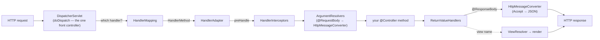

# Part 3 · Web: MVC, REST & Reactive

> A Spring web app is one front controller in front of a pipeline of strategy interfaces. Once you
> can *name every stage* — mapping, adapter, interceptors, argument resolvers, message converters,
> return-value handlers — then "why did my request 404 / not deserialize / not validate / return the
> wrong status" stops being a mystery and becomes a question about *one specific, inspectable stage.*
> [← curriculum index](../README.md)

This is the part where the container you built in Parts 0–2 finally faces the network. Everything
here is still beans — the `DispatcherServlet` is a bean, every `HandlerMapping` and
`HttpMessageConverter` is a bean, your `@ControllerAdvice` is a bean — but now they're wired into a
*request-processing pipeline* with a fixed, ordered shape. Learn that shape once and it pays off
forever: the servlet MVC stack and the reactive WebFlux stack are the **same pipeline with different
plumbing**, and "should I go reactive?" becomes a sober concurrency-model decision instead of a
cargo-cult one — especially now that Boot 3.2+ virtual threads let plain blocking MVC scale to the
concurrency people used to reach for WebFlux to get.

---

## Learning objectives — what "I know this" actually means

By the end of this part you can, **from memory and out loud**:

- Trace a request end-to-end through the **`DispatcherServlet`**: one front controller dispatches to
  a `HandlerMapping` (which handler?) → a `HandlerAdapter` (invoke it), with `HandlerInterceptor`s
  around it, `HandlerMethodArgumentResolver`s building the method arguments, the handler running,
  then `HandlerMethodReturnValueHandler`s / `HttpMessageConverter`s turning the return value into a
  response — `ViewResolver` for a view, or straight to the body for `@ResponseBody`/`@RestController`.
- Explain **exactly how `@RequestBody` deserializes**: it is *not* magic, it's
  `RequestResponseBodyMethodProcessor` picking an `HttpMessageConverter` by matching the request's
  `Content-Type` against each converter's supported media types (Jackson's
  `MappingJackson2HttpMessageConverter` for JSON), and the mirror path for `@ResponseBody` driven by
  the `Accept` header (**content negotiation**).
- Build a robust REST API: content negotiation, **`@ControllerAdvice` + `@ExceptionHandler`** for
  centralized error mapping, **Bean Validation** (`@Valid` → `MethodArgumentNotValidException`), and
  **`ProblemDetail` / RFC 7807** as the Boot 3 first-class error format (and that the package moved
  to `jakarta.validation.*`).
- Explain **WebFlux & Reactor**: `Mono` (0/1) and `Flux` (0..N) as lazy push-based publishers,
  non-blocking I/O on a small event-loop pool, default server **Reactor Netty**, the analog front
  controller `DispatcherHandler`, and **backpressure** as the consumer signalling demand upstream.
- State, precisely, **when reactive earns its complexity** (you have an *end-to-end* non-blocking
  stack and genuinely high concurrency / many slow upstream calls per request) versus when it's pure
  tax (any blocking JDBC/JPA call in the chain stalls an event-loop thread and destroys the model).
- Distinguish a **servlet `Filter`** (runs in the container, before/outside the
  `DispatcherServlet`, sees raw `Servlet{Request,Response}`) from a Spring **`HandlerInterceptor`**
  (runs *inside* the dispatch, knows the chosen handler), and explain **Boot 3.2+ virtual threads**
  (`spring.threads.virtual.enabled=true`) — how they make simple blocking MVC scale and *partly
  obviate* reactive (ties to [`../../java/`](../../java/) Loom).

## Topic checklist

- [ ] **16 · Spring MVC Internals: the `DispatcherServlet`** — the **one** front controller pattern;
      `doDispatch` as the readable heart of it; `HandlerMapping` (`RequestMappingHandlerMapping`
      resolves `@RequestMapping`/`@GetMapping` to a `HandlerMethod`) → `HandlerAdapter`
      (`RequestMappingHandlerAdapter` invokes it) with `HandlerInterceptor`s wrapping it;
      `HandlerMethodArgumentResolver`s populating `@PathVariable`/`@RequestParam`/`@RequestBody`/etc.;
      `HandlerMethodReturnValueHandler`s + `HttpMessageConverter`s on the way out; `ViewResolver` for
      view rendering vs. direct body writing; the servlet stack is **blocking, thread-per-request**.
      Boot auto-registers the `DispatcherServlet` as a bean — it's not magic, it's
      `DispatcherServletAutoConfiguration` ([Part 2](../02-spring-boot-core/)).
- [ ] **17 · Building REST APIs: Negotiation, Errors & Validation** — `@RestController` =
      `@Controller` + `@ResponseBody`; **content negotiation** (`Accept`/`Content-Type` → converter
      selection); `ResponseEntity` for explicit status/headers; **Bean Validation** with `@Valid`/
      `@Validated` (now `jakarta.validation`) and how a violation becomes
      `MethodArgumentNotValidException`; centralized handling with **`@ControllerAdvice` +
      `@ExceptionHandler`**; **`ProblemDetail` / RFC 7807** as Boot 3's standard problem format
      (`ResponseEntityExceptionHandler` already emits it for Spring's own exceptions); idempotency,
      status-code discipline, and why "200 with an error body" is a smell.
- [ ] **18 · WebFlux & Reactive (Reactor, Backpressure, When to Use)** — Project Reactor: `Mono`
      (0/1) and `Flux` (0..N) as **lazy** publishers that do nothing until subscribed; non-blocking
      I/O on a small fixed event-loop pool; default server **Reactor Netty**; the front controller is
      `DispatcherHandler` (annotated `@Controller` *or* functional `RouterFunction`); **backpressure**
      = the consumer signals demand (`request(n)`) so a fast producer can't overwhelm a slow consumer;
      `WebClient` as the non-blocking HTTP client; the cardinal rule — **one blocking call anywhere in
      the chain poisons the event loop.** Reactive is a *concurrency model*, not a speed dial.
- [ ] **19 · Filters, Interceptors, the Servlet/Reactive Stacks & Virtual Threads** — servlet
      **`Filter`** chain (container-level, `DelegatingFilterProxy` bridges Spring beans in — the seam
      [Spring Security](../05-production/) hangs off of) vs. **`HandlerInterceptor`**
      (`preHandle`/`postHandle`/`afterCompletion`, inside the dispatch, knows the handler) vs. the
      reactive **`WebFilter`**; the two stacks are mutually exclusive within one app (servlet =
      Tomcat/Jetty/Undertow, reactive = Netty); **Boot 3.2+ virtual threads**
      (`spring.threads.virtual.enabled=true`) run each blocking request on a cheap virtual thread so
      thread-per-request scales to tens of thousands of concurrent requests — the pragmatic answer to
      most of the problems reactive was reached for. Ties straight to
      [`../../java/`](../../java/) Loom (carriers, mount/unmount, **pinning** — `synchronized` in your
      request path is the trap to hunt here too).

## The principal-level insight

**There is exactly one front controller, and behind it a pipeline of replaceable strategy
interfaces — so every web question is "which stage?"** A junior debugs the web layer by guessing and
re-deploying. A principal names the stage: a 404 is a **`HandlerMapping`** miss (no handler matched
that path/method — check `/actuator/mappings`); a 415/406 is a **content-negotiation /
`HttpMessageConverter`** failure (no converter for that `Content-Type`/`Accept`); a body that won't
populate is a **`HandlerMethodArgumentResolver`** problem; a `400` with field errors is **Bean
Validation** firing into `MethodArgumentNotValidException`; an unhandled 500 with the wrong shape is
a missing **`@ControllerAdvice`**. The stack isn't a black box you poke — it's a *named sequence you
can point at.* And the second half of the insight: **reactive is a concurrency-model choice, not a
performance knob.** WebFlux doesn't make a single request faster — it changes *how threads relate to
requests* (a few event-loop threads multiplexing thousands of non-blocking operations instead of one
thread parked per request). That only pays off when the whole chain is non-blocking and concurrency
is genuinely high; drop one blocking JDBC call into a Netty event loop and you've built something
*slower and far harder to debug* than plain MVC. Since Boot 3.2, **virtual threads give you the
scalability of the reactive model while keeping the straight-line, debuggable, stack-trace-friendly
blocking code** — so "go reactive for throughput" is, for most services, no longer the right reflex.
The principal reasons about the thread model on purpose; the cargo-culter picks `Mono` because a
conference talk said it was fast.

## Drills (build, don't just read)

Spring's analog of the [`../../java/`](../../java/) track's *"measure it on a real JVM"* is
**make the pipeline visible** — set a breakpoint and *watch* a request walk the stages. Do these in
a throwaway Boot web app, not in your head.

1. **Breakpoint `DispatcherServlet.doDispatch` and walk the stages.** Put a breakpoint on
   `getHandler(...)`, `getHandlerAdapter(...)`, the `ha.handle(...)` call, and step through one GET
   request. Name each object you land in (`RequestMappingHandlerMapping`,
   `RequestMappingHandlerAdapter`, the argument resolvers, the return-value handlers). Then turn on
   `logging.level.org.springframework.web=DEBUG` and read the same story in the logs. After this the
   pipeline is yours.
2. **Inspect `/actuator/mappings`.** Enable the endpoint and dump it. Find one of your handlers and
   read off the path, method, produces/consumes, and the bean it maps to. Now *delete* a
   `@GetMapping` path segment, hit the old URL, and confirm the 404 is exactly a `HandlerMapping`
   miss — not a bug, an *absent mapping* you can see in the report.
3. **Write a `@ControllerAdvice` and a custom `HttpMessageConverter`.** Add a `@RestControllerAdvice`
   with an `@ExceptionHandler` that returns a `ProblemDetail` (RFC 7807) for your domain exception;
   confirm the JSON shape and status. Then register a trivial custom `HttpMessageConverter` for a
   bespoke media type, set `produces=`/`Accept` to select it, and watch content negotiation route the
   response through *your* converter instead of Jackson.
4. **Build the same endpoint MVC vs WebFlux and compare.** Implement `/users/{id}` once as blocking
   MVC (`@RestController` returning a DTO) and once as WebFlux (`Mono<DTO>` with `WebClient`). Make the
   upstream call slow. Load-test both. Then — the instructive part — put a **blocking** JDBC/JPA call
   inside the WebFlux handler and watch latency collapse as event-loop threads stall. *That* failure
   teaches the rule better than any blog post.
5. **Turn on virtual threads and reason about the thread model.** Set
   `spring.threads.virtual.enabled=true` on the blocking MVC version, re-run the high-concurrency
   load test, and watch thread-per-request scale without a fat pool. Take a `jstack`/thread dump and
   observe virtual threads parked on I/O. Then introduce a `synchronized` block on the request path
   and detect the **pinning** with `-Djdk.tracePinnedThreads=full` — the same trap from the
   [`../../java/`](../../java/) Loom chapter, now in a web context.

## Interview lens

This is the most *visible* part of Spring, so it's a staple of senior/staff backend interviews. The
classics: ***"Walk a request through Spring MVC"*** — the interviewer is listening for the named
stages (`DispatcherServlet` → `HandlerMapping` → `HandlerAdapter` → resolvers → handler →
return-value handlers/`HttpMessageConverter` → view or body), not "the controller handles it."
***"MVC vs WebFlux — and when would you choose each?"*** — the signal is reasoning about the *thread
model* (thread-per-request vs event-loop), insisting on **end-to-end non-blocking**, and naming the
blocking-JDBC trap; bonus points for raising **virtual threads** as the reason the old "go reactive
for scale" answer is now usually wrong. ***"How does `@RequestBody` deserialize?"*** — `Content-Type`
→ `HttpMessageConverter` selection → Jackson, *not* "Spring just maps it." ***"`Filter` vs
`Interceptor`?"*** — container-level/raw-servlet/outside-dispatch vs. inside-dispatch/handler-aware,
with `DelegatingFilterProxy` as the bridge. ***"Do virtual threads make WebFlux unnecessary?"*** —
the nuanced answer ("for most services, yes — virtual threads give you the concurrency without the
programming-model cost; WebFlux still wins for true streaming, backpressure to the client, or when
you're already all-reactive") reads as principal. The discriminator throughout: do you reason about
**a named pipeline and a deliberate thread model**, or recite annotations?

## Make the invisible visible

You never have to *believe* a claim about the web layer — you can watch it on a running context:

- **`logging.level.org.springframework.web=DEBUG`** narrates the dispatch; `TRACE` shows converter
  and resolver selection.
- **`/actuator/mappings`** lists every handler mapping (the ground truth for any 404); `/beans` shows
  the `HandlerMapping`/`HandlerAdapter`/`HttpMessageConverter` beans the web auto-config registered.
- **Breakpoints** in `DispatcherServlet.doDispatch` (servlet) and `DispatcherHandler.handle`
  (reactive) — the source is short and readable; read it.
- For reactive, **`.log()`** on a `Mono`/`Flux` prints the Reactive Streams signals
  (`onSubscribe`/`request(n)`/`onNext`/`onComplete`) so you can *see* subscription and backpressure;
  Reactor's `BlockHound` flags an accidental blocking call on an event-loop thread.

Every arrow is a stage you can name, inspect, and replace — and every "why did my request do X"
lands on exactly one of them. That single picture is most of the part.

## Visualizations

See [`visualizations/`](visualizations/): **dispatcherservlet-flow** (a request animating through
mapping → adapter → interceptors → argument resolvers → handler → return-value handlers/converters →
view-or-body, with the failure points lit up at each stage) and **reactive-backpressure** (a fast
`Flux` producer and a slow consumer, the consumer signalling `request(n)` demand upstream and the
producer throttling to match — the idea that's almost impossible to picture from prose alone). Full
catalog and conventions in [VISUALIZATIONS.md](../../java/VISUALIZATIONS.md).
