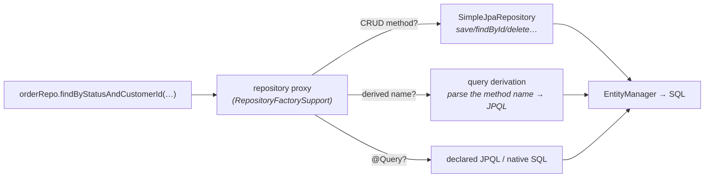

# 20 · Spring Data & the Repository Abstraction

> You write an **interface**; at startup Spring Data builds a **dynamic proxy** that turns method
> names into queries. How that works, what it's great at, and exactly where the abstraction leaks.
> [← Part 4 · Data & Transactions](README.md) · next: 21 · JPA & the Persistence Context

> **Predict first (2 min).** `interface OrderRepo extends JpaRepository<Order, Long> { List<Order>
> findByStatusAndCustomerId(Status s, Long id); }` — you never write an implementation. What *object*
> actually gets injected, and how does it know what SQL to run? Write your guess.

---

## An interface becomes a bean — the repository proxy

There is no `OrderRepoImpl`. At startup, Spring Data's **`RepositoryFactorySupport`** creates a
**JDK dynamic proxy** ([the java track's proxy machinery](../../java/00-platform-and-mental-model/))
implementing your interface, and registers it as a bean. Each call routes through the proxy:

That's the prediction answered: the injected object is a **generated proxy**; built-in CRUD goes to
`SimpleJpaRepository`, and your finder was **parsed at startup** — `findByStatusAndCustomerId` →
`where status = ?1 and customerId = ?2` (JPQL, then SQL). ⚡ Because parsing happens at startup, a
typo'd property name **fails fast at boot**, not at first call — a feature.

## The three query styles (and when each)

1. **Derived queries** — `findByEmailContainingIgnoreCase(...)`, `existsBy…`, `countBy…`, `deleteBy…`,
   `findTop3By…OrderByCreatedDesc`. Great for simple lookups; ⚡ past 2–3 conditions the names become
   unreadable — switch styles.
2. **`@Query`** — explicit JPQL (or `nativeQuery = true` for SQL). Use for joins, aggregates, anything
   non-trivial; supports `@Modifying` updates.
3. **Dynamic** — `Specification<T>` (criteria composition), Querydsl, or **Query by Example** for
   filter screens with optional criteria.

Plus the supporting cast: **`Pageable`/`Sort`** (⚡ prefer keyset/cursor for deep pages — offset
degrades), **projections** (interface or DTO — fetch only needed columns; often the cleanest N+1 and
`LazyInitializationException` fix, [chapter 21](README.md)), and **auditing**
(`@CreatedDate`/`@LastModifiedDate` + `@EnableJpaAuditing`).

## Where the abstraction leaks (the principal's checklist)

- **Derived ≠ optimal.** The generated query can be worse than hand SQL (no hints, awkward joins).
  Read the SQL log for hot paths; drop to `@Query` or **`JdbcClient`** ([chapter 23](README.md)).
- **It's still JPA underneath.** Every finder runs through the persistence context — N+1, flush
  timing, and dirty checking ([chapter 21](README.md)) apply unchanged. `@EntityGraph` on repository
  methods is the fetch-tuning knob.
- **Transactions:** `SimpleJpaRepository` methods are `@Transactional` themselves (reads
  `readOnly=true`), so single calls work bare — but ⚡ **multi-call consistency needs your own
  `@Transactional` service boundary** ([chapter 22](README.md)); two repo calls ≠ one transaction.
- **Custom needs a fragment:** for a hand-written method, declare `interface OrderRepoCustom` +
  `OrderRepoCustomImpl` (the `Impl` suffix is the convention) and extend both — the proxy merges them.

## Make it visible

- **See the proxy.** Inject the repo and print `repo.getClass()` — a `jdk.proxy` class, not your
  interface. `AopUtils.isJpaRepository`-style checks, or debug into `RepositoryFactorySupport`.
- **Fail-fast derivation.** Rename a property used in a finder and start the app — boot fails with a
  `PropertyReferenceException` naming the method. Query parsing is a startup event.
- **Compare the SQL.** `logging.level.org.hibernate.SQL=DEBUG`; run a derived query, an `@Query`, and
  a `JdbcClient` version of the same lookup — same rows, different control.

## Self-Check (close the doc, answer out loud)

1. There's no `Impl` class — what gets injected, who builds it, and when do finder typos fail?
2. Walk `findByStatusAndCustomerId` from method name to SQL.
3. When do you move from derived queries to `@Query` to `Specification` to `JdbcClient`?
4. Why are single repository calls transactional but two calls in a row not atomic? What fixes it?
5. Name three ways this abstraction leaks and the mitigation for each.
6. How do you add a hand-written method to a Spring Data repository?

> **Go deeper:** the Spring Data JPA reference → "Defining Query Methods"; read
> `SimpleJpaRepository` and `RepositoryFactorySupport`; then [21 · the Persistence Context](README.md)
> and [23 · JDBC, Pooling & Caching](README.md).
