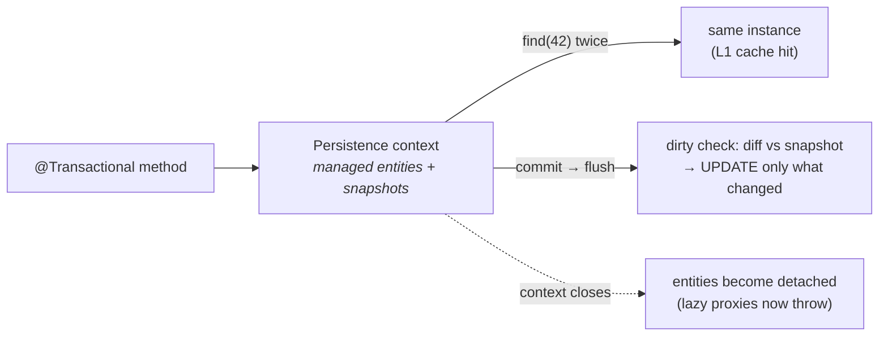

# 21 · JPA/Hibernate Integration & the Persistence Context

> The **persistence context is the first-level cache**, scoped to the transaction — and once you see
> it, the three classic data bugs (no-`save()`-needed dirty checking, `LazyInitializationException`,
> and **N+1**) become one story about *"is there an open session, and what's managed in it?"*
> [← Part 4 · Data & Transactions](README.md) · prev: 20 · Spring Data · next: 22 · Transaction Internals

> **Predict first (2 min).** Inside a `@Transactional` method you load an entity, call a setter, and
> **never call `save()`**. Does the change hit the database? And: you return that entity from the
> service and the controller touches a lazy `@OneToMany` — what happens? Write your guesses.

---

## The persistence context = the first-level cache

Every `EntityManager` (Hibernate: `Session`) owns a **persistence context** — a map of
**managed entities** keyed by id, alive for the duration of the (usually transaction-scoped) session:

- **Identity guarantee:** loading the same id twice in one context returns the **same instance** (the
  second `find` doesn't even hit the DB — it's a cache hit).
- **Entity lifecycle:** *transient* (new, unknown) → **managed** (in the context, tracked) →
  *detached* (context closed — no longer tracked) → *removed*.
- **Dirty checking:** at **flush time** (commit, or before a query that needs fresh data), Hibernate
  diffs every managed entity against its loaded **snapshot** and emits `UPDATE`s for what changed.

So the first prediction: **yes — the setter alone persists.** The entity is *managed*; commit
triggers flush; dirty checking finds the change; an `UPDATE` runs. `save()` on a managed entity is
redundant (its real job is transitioning *transient* → managed, and merging detached entities).
⚡ Corollary: mutate a managed entity "just in memory" inside a transaction and you've written to the
DB — a real bug class.



---

## Lazy loading — proxies with a lifeline to the session

A lazy association (`@OneToMany` is lazy by default; ⚡ `@ManyToOne` is **eager** by default — often
worth making lazy) isn't loaded with the owner. Hibernate installs a **proxy** (a placeholder — the
same trick as [Spring AOP](../01-extension-and-aop/07-spring-aop-proxies.md), different purpose):
touch it and the proxy runs a query *through the still-open session*.

The second prediction: the controller runs **after** the `@Transactional` method returned → the
context closed → the entity is **detached** → the lazy proxy has no session →
**`LazyInitializationException`**. Fixes, best first:

1. **Return a DTO/projection** shaped for the view (fetch exactly what it needs inside the tx).
2. **Fetch eagerly for this query** (`join fetch` / `@EntityGraph`) when you know you'll need it.
3. ⚡ **Not** `spring.jpa.open-in-view` — Boot's default **OSIV keeps the session open through the
   whole web request**, which "fixes" the exception but hides N+1s in the view layer and holds a DB
   connection for the request's full duration. Consider `spring.jpa.open-in-view=false` and doing
   fetching deliberately.

---

## The N+1 problem — lazy loading in a loop

```java
List<Order> orders = orderRepo.findAll();          // 1 query
for (Order o : orders) o.getItems().size();        // N queries — one per order!
```

One query for the parents, then **one more per parent** as each lazy proxy initializes: **N+1
round-trips**, the top JPA performance bug. It hides in innocent code (a template iterating a
relation). **See it:** SQL logging (`logging.level.org.hibernate.SQL=DEBUG`) or
`hibernate.generate_statistics=true` (query count per request). **Kill it:**

- **`join fetch`** (JPQL) or **`@EntityGraph`** on the repository method — load parents + children in
  one query.
- **`@BatchSize(size=…)`** / `default_batch_fetch_size` — initialize lazy proxies in `IN (…)` batches
  (N+1 → N/batch + 1).
- **Projections/DTO queries** — skip entity graphs entirely for read views.

> ▶ **Watch it:** [`persistence-context.html`](visualizations/persistence-context.html) — entities
> becoming managed, dirty checking flushing on commit, then a detached lazy proxy throwing and an N+1
> loop hammering the DB.

---

## Flush timing (the last surprise)

Flush ≠ commit. Hibernate flushes **at commit**, **before a JPQL/SQL query whose results could be
affected** by pending changes (so queries see your writes), or on explicit `flush()`. Consequence:
your `UPDATE`s may run mid-transaction *earlier* than you expect (before a query), or as late as
commit — don't reason about exact SQL timing from code order. (And the DB work all still commits or
rolls back atomically with the transaction — [chapter 22](README.md).)

---

## Make it visible

- **Dirty checking.** `logging.level.org.hibernate.SQL=DEBUG`; load-mutate-don't-save in a
  transaction → watch the `UPDATE` at commit. Repeat on a detached entity → no SQL.
- **L1 identity.** `em.find(Order.class, 42) == em.find(Order.class, 42)` inside one tx → `true`, and
  the log shows **one** `SELECT`.
- **Reproduce both bugs.** Return an entity from the service and touch a lazy field in the controller
  (with OSIV off) → `LazyInitializationException`. Loop over a lazy relation → count the N+1 queries
  with statistics, then fix with `@EntityGraph` and count again.

---

## Self-Check (close the doc, answer out loud)

1. What is the persistence context, what's its scope, and what two guarantees does it give?
2. Walk the entity lifecycle. Why does a setter persist without `save()` — and when *do* you need `save()`?
3. Why does `LazyInitializationException` happen, mechanically? Rank three fixes and explain the OSIV trade-off.
4. What is N+1, how do you *detect* it, and what are three fixes?
5. When does Hibernate flush? Why can an `UPDATE` run before your commit?
6. Which associations are lazy vs eager by default, and which default is the trap?

> **Go deeper:** Vlad Mihalcea's *High-Performance Java Persistence* (the book for this); the
> Hibernate user guide → "Persistence Context"; then [22 · Transaction Management Internals](README.md)
> — the proxy that opens the session this chapter lives in.
