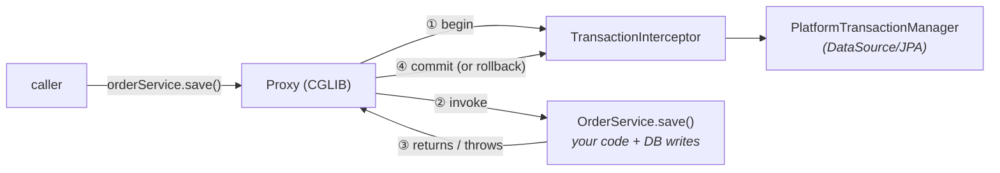

# 22 · Transaction Management Internals

> `@Transactional` demystified — it's **AOP advice on a proxy** that begins/commits a transaction, and
> the proxy boundary **is** the transaction boundary. Propagation, rollback rules, and the two traps
> that silently break it.
> [← Part 4 · Data & Transactions](README.md) · prev: 21 · JPA & the Persistence Context · next: 23 · JDBC & Caching

> **Predict first (2 min).** A `@Transactional` method throws a **checked** exception — does the
> transaction roll back? And if a method calls `this.otherTransactionalMethod()`, does that inner
> method get its *own* transaction? Write your guesses — both are classic production bugs.

---

## What `@Transactional` actually is

Not magic — the same **proxy** mechanism as all Spring AOP ([chapter 07](../01-extension-and-aop/)):

The proxy's `TransactionInterceptor` **begins** a transaction (via the `PlatformTransactionManager` —
`DataSourceTransactionManager` for JDBC, `JpaTransactionManager` for JPA) *before* your method,
**commits** after it returns, or **rolls back** if it throws. So **the proxy boundary is the
transaction boundary**, and the transaction scopes the persistence context ([chapter 21](README.md)).

> ▶ **Watch it:** [`transaction-proxy.html`](visualizations/transaction-proxy.html) — begin → commit /
> rollback, a self-invocation that skips the transaction, and a `REQUIRES_NEW` nesting.

---

## Rollback rules ⚡ (the checked-exception trap)

> **By default, the transaction rolls back on `RuntimeException` / `Error` (unchecked) — but NOT on
> checked exceptions.** A `@Transactional` method that throws a checked `IOException` will **commit**.

That's the first prediction, and it bites constantly. If a checked exception should roll back, say so:
`@Transactional(rollbackFor = IOException.class)` (or `noRollbackFor` for the reverse). Also: once a tx
is marked rollback-only (an inner failure), the outer commit throws `UnexpectedRollbackException`.

## Propagation — what happens when a tx-method calls another

| Propagation | Behavior |
|---|---|
| **REQUIRED** (default) | join the caller's transaction, or start one if none |
| **REQUIRES_NEW** | **suspend** the caller's tx, run in a **brand-new independent** physical tx (commits/rolls back on its own) |
| **NESTED** | a **savepoint** inside the caller's tx (inner rollback → back to savepoint, not the whole tx) |
| **SUPPORTS** | join if one exists, else run non-transactionally |
| **MANDATORY** | must run in an existing tx, else error |
| **NOT_SUPPORTED** / **NEVER** | suspend & run non-tx / error if a tx exists |

Use `REQUIRES_NEW` for "must persist regardless of the caller" (an audit log, an outbox row). Use
`NESTED` for partial rollback within one tx.

## Isolation (one line each)
`READ_UNCOMMITTED` (dirty reads) → `READ_COMMITTED` (no dirty; default on most DBs) → `REPEATABLE_READ`
(no non-repeatable reads) → `SERIALIZABLE` (no phantoms; slowest). `@Transactional(isolation=…)` maps
to the DB's isolation. (Anomaly details → [../../HLD/](../../HLD/) on transactions.)

`readOnly=true` is a hint — the tx manager/JPA can skip dirty-check flushing and the DB may optimize.

---

## The two traps (both from "it's a proxy")

1. ⚡ **Self-invocation.** `this.audit()` from inside the same bean **bypasses the proxy**, so the
   inner `@Transactional` (even `REQUIRES_NEW`) is **ignored** — it just runs in the caller's tx (or
   none). That's the second prediction: **no new transaction.** Fix: move the method to another bean
   and call it through *its* proxy (the animation shows both).
2. ⚡ **`private`/`final` methods** can't be proxied → no advice. `@Transactional` only works on
   `public` methods reached across a proxy.

(Both vanish with **AspectJ load-time weaving**, which rewrites the method itself instead of wrapping
it — but Spring's default is proxy-based.)

---

## Make it visible

- **See the tx lifecycle.** `logging.level.org.springframework.transaction.interceptor=TRACE` —
  watch "Getting transaction for [...save]" and the commit/rollback per method.
- **Reproduce the checked-exception commit.** Throw a checked exception from a `@Transactional` method
  and confirm the row *persisted* (no rollback). Add `rollbackFor` and watch it roll back.
- **Reproduce the self-invocation trap.** Call a `@Transactional(REQUIRES_NEW)` method via `this.`;
  the TRACE log shows **no** new transaction. Move it to another bean → a new tx appears.

---

## Self-Check (close the doc, answer out loud)

1. What is `@Transactional` mechanically? What plays the role of "begin/commit," and what's the
   transaction boundary?
2. Default rollback rules — checked vs unchecked. How do you change them, and what's the classic bug?
3. `REQUIRED` vs `REQUIRES_NEW` vs `NESTED` — what physically happens in each?
4. Explain the self-invocation trap. Why is a self-invoked `REQUIRES_NEW` ignored, and how do you fix it?
5. Why don't `private`/`final` methods get transactional behavior?
6. What does `readOnly=true` buy you, and how does the tx relate to the JPA persistence context?

> **Go deeper:** read `TransactionInterceptor` and `AbstractPlatformTransactionManager` in the source;
> the reference → "Transaction Management"; then [23 · JDBC, Pooling & Caching](README.md).
