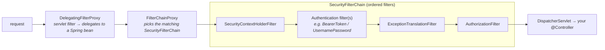

# 24 · Spring Security Internals: the Filter Chain

> Spring Security is "just" an **ordered chain of servlet filters** — authentication populates the
> `SecurityContext`, authorization checks it, and everything else is *which filter, in what order*.
> Once you see the chain, security stops being magic and 403s become debuggable.
> [← Part 5 · Production](README.md) · next: 25 · Actuator & Observability

> **Predict first (2 min).** When a request with a bad token gets a 401, has your controller run yet?
> And: in Spring Security 6, where do you put configuration now that `WebSecurityConfigurerAdapter`
> is gone? Write your guesses.

---

## The architecture: filters before the DispatcherServlet

Security runs in the **servlet filter** layer — *before* Spring MVC's `DispatcherServlet`
([chapter 16](../03-web-mvc-and-reactive/)) ever sees the request:



- **`DelegatingFilterProxy`** — a plain servlet filter registered with the container; its only job is
  to **delegate into a Spring bean** (bridging the servlet world and the `ApplicationContext`).
- **`FilterChainProxy`** — that bean; holds one or more **`SecurityFilterChain`s** and picks the
  first whose `securityMatcher` matches the request (you can have different chains for `/api/**` vs
  web pages).
- **The chain itself** — an *ordered* list of filters. The order **is** the semantics.

So the first prediction: **no — a rejected request short-circuits in the filter chain** (401 from the
authentication layer, 403 from authorization) and **never reaches your controller**. That's the whole
design: security wraps the application, it isn't sprinkled inside it.

> ▶ **Watch it:** [`security-filter-chain.html`](visualizations/security-filter-chain.html) — one
> request authenticating and reaching the controller; a bad-token request short-circuiting mid-chain.

---

## The filters that matter (in order)

| Filter | Job |
|---|---|
| `SecurityContextHolderFilter` | load/clear the **`SecurityContext`** around the request |
| `CsrfFilter` | verify the CSRF token on state-changing requests (cookie-session apps) |
| **Authentication filters** | establish *who you are*: `UsernamePasswordAuthenticationFilter` (form login), `BearerTokenAuthenticationFilter` (JWT/OAuth2 resource server), `BasicAuthenticationFilter` |
| `ExceptionTranslationFilter` | catch downstream `AccessDeniedException`/auth failures → **401** (unauthenticated) or **403** (authenticated but forbidden) |
| **`AuthorizationFilter`** (last) | check *what you may do*: evaluates your `authorizeHttpRequests` rules against the `Authentication` |

### Authentication: manager, providers, and the principal

An authentication filter extracts credentials and calls the **`AuthenticationManager`**
(`ProviderManager`), which asks its **`AuthenticationProvider`s** to authenticate — e.g.
`DaoAuthenticationProvider` loads the user via **`UserDetailsService`** and checks the password with a
**`PasswordEncoder`** (**BCrypt** by default — never plain text). Success produces an
**`Authentication`** (principal + authorities) stored in the **`SecurityContextHolder`**
(thread-local by default — ⚡ mind async/virtual-thread propagation).

### Authorization

`authorizeHttpRequests((auth) -> auth.requestMatchers("/admin/**").hasRole("ADMIN").anyRequest().authenticated())`
— evaluated by the `AuthorizationFilter` at the *end* of the chain. **Method security**
(`@EnableMethodSecurity` + `@PreAuthorize("hasRole('ADMIN')")`) adds a second, finer layer — and it's
**AOP** ([chapter 07](../01-extension-and-aop/)), so ⚡ the **self-invocation trap applies**: a
`this.method()` call skips the `@PreAuthorize` check.

---

## Security 6 configuration (the second prediction)

`WebSecurityConfigurerAdapter` was **removed** in Spring Security 6 — you declare beans:

```java
@Configuration @EnableWebSecurity
class SecurityConfig {
    @Bean
    SecurityFilterChain api(HttpSecurity http) throws Exception {
        return http
            .securityMatcher("/api/**")
            .authorizeHttpRequests(a -> a.requestMatchers("/api/admin/**").hasRole("ADMIN")
                                          .anyRequest().authenticated())
            .oauth2ResourceServer(o -> o.jwt(Customizer.withDefaults()))
            .csrf(c -> c.disable())            // stateless token API — no cookie session
            .sessionManagement(s -> s.sessionCreationPolicy(STATELESS))
            .build();
    }
}
```

Each `HttpSecurity` DSL call configures *which filters* end up in the chain and how. ⚡ **CSRF**: keep
it **on** for cookie-session apps (the browser auto-sends cookies — forgeable); it's safe to disable
for **stateless bearer-token** APIs (the token isn't auto-attached). ⚡ `antMatchers` →
`requestMatchers` (renamed in 6).

---

## Make it visible

- **See your chain.** On startup with `logging.level.org.springframework.security=DEBUG`, Spring logs
  every `SecurityFilterChain` and its filters *in order* — read it once and the architecture is real.
- **Trace one request.** With DEBUG on, send an authenticated and an unauthenticated request; watch
  which filter rejects and where the short-circuit happens (the controller log line never appears).
- **Prove the AOP trap.** Put `@PreAuthorize` on a method and call it via `this.` from the same bean —
  watch the check *not* run ([the proxy chapter](../01-extension-and-aop/07-spring-aop-proxies.md)'s
  trap, in security clothing).

---

## Self-Check (close the doc, answer out loud)

1. Where does Spring Security run relative to the `DispatcherServlet`, and what do
   `DelegatingFilterProxy` and `FilterChainProxy` each do?
2. Walk a bearer-token request through the chain: which filter authenticates, what object lands where,
   and which filter authorizes?
3. 401 vs 403 — which filter translates each, and what's the semantic difference?
4. How do you configure security in Spring Security 6? What replaced `WebSecurityConfigurerAdapter`?
5. When is disabling CSRF correct, and why exactly?
6. Why can a self-invoked `@PreAuthorize` method skip its check?

> **Go deeper:** the Spring Security reference → "Servlet Architecture" (its diagrams mirror this
> chapter); read `FilterChainProxy` and `AuthorizationFilter` in the source; then
> [25 · Actuator & Observability](README.md).
