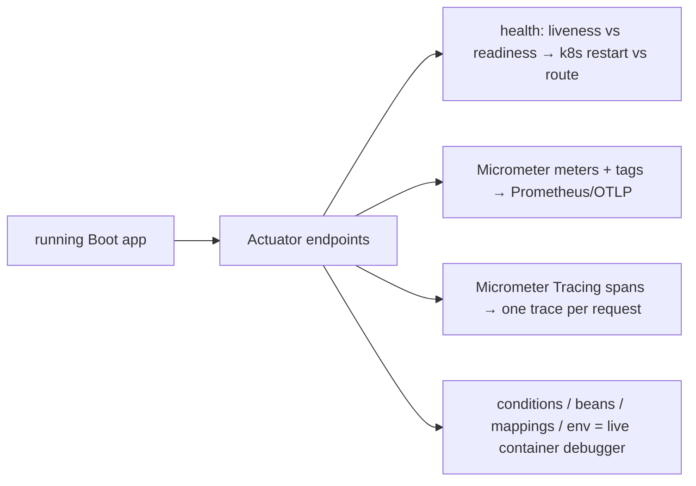

# 25 · Actuator & Observability (Micrometer, Metrics, Tracing)

> Production readiness is "can you see what it's doing without redeploying?" Actuator exposes the
> app's insides over HTTP; **Micrometer** turns them into vendor-neutral metrics and traces; and the
> same endpoints double as a **live debugger** for the container itself.
> [← Part 5 · Production](README.md) · prev: 24 · Security Internals · next: 26 · Testing Spring Boot

> **Predict first (2 min).** Kubernetes wants two different health answers: "restart this container?"
> and "send it traffic?" Why must those be *different* endpoints — what's a state where the answers
> disagree? And: your app records `http.server.requests` — how does one metric answer "p99 latency of
> POST /orders that returned 500"? Write your guesses.

---

## Actuator: the app's insides, over HTTP

Add `spring-boot-starter-actuator` and Boot exposes operational endpoints under `/actuator/*`:

| Endpoint | What it answers |
|---|---|
| `/health` | up/down (aggregated from **HealthIndicator**s: DB ping, disk, custom) |
| `/metrics` | every Micrometer meter, queryable by name/tags |
| `/env`, `/configprops` | resolved config **with origins** ([ch.14](../02-spring-boot-core/)) |
| `/beans`, `/conditions`, `/mappings` | the live container: every bean, why each auto-config fired/didn't, every route |
| `/loggers` | view **and change** log levels at runtime |
| `/threaddump`, `/heapdump` | JVM-level diagnostics ([java ch.27](../../java/05-io-interop-deployment/)) |

- ⚡ **Exposure vs enablement:** most endpoints are enabled but **not exposed** over HTTP by default —
  only `/health`. `management.endpoints.web.exposure.include=health,metrics,...` opts in.
- ⚡ **Secure them:** `/env` and `/heapdump` leak secrets/memory. Lock actuator routes behind auth
  ([ch.24](README.md)) or a separate management port (`management.server.port`).

## Health: liveness vs readiness

The prediction's first answer. Boot ships two **probe groups** (`/actuator/health/liveness`,
`/readiness`) because the questions differ:

- **Liveness** — "is the process broken beyond recovery?" → k8s **restarts** on failure.
- **Readiness** — "can it serve traffic *right now*?" → k8s **removes it from the load balancer**.

The disagree state: the app is **alive but warming up** (or its DB is briefly down) — readiness
fails so traffic routes elsewhere, but liveness passes so k8s doesn't restart a healthy process.
⚡ Wiring a DB check into *liveness* causes restart storms during a DB blip — the classic probe bug.
Custom checks = a `HealthIndicator` bean; assign it to a group in properties.

## Micrometer: the metrics facade (dimensional, not hierarchical)

**Micrometer** is to metrics what SLF4J is to logging — one API (`MeterRegistry`), many backends
(Prometheus, OTLP, Datadog…). Meters: **counter** (monotonic count), **gauge** (current value),
**timer** (count + latency distribution/percentiles), plus distribution summaries.

The prediction's second answer: meters are **dimensional** — one name plus **tags**:

```java
Timer.builder("http.server.requests")
     .tags("method","POST", "uri","/orders", "status","500")
     .register(registry);
// query: http.server.requests{method="POST",uri="/orders",status="500"} → p99
```

One metric name, sliced by any tag combination at query time — that's how `http.server.requests`
(auto-recorded for every endpoint) answers per-route/per-status p99 without a metric-per-route
explosion. ⚡ **Tag cardinality is the trap:** never tag with unbounded values (user ID, order ID) —
each unique tag set is a separate time series and will melt your metrics backend.

## Tracing: Micrometer Tracing (Boot 3) & the Observation API

Boot 3 replaced Sleuth with **Micrometer Tracing**: spans/trace-ids propagate across HTTP/messaging
so one request's path through N services becomes one **trace** (export via OTLP/Zipkin bridges). The
unifying layer is the **Observation API** (`ObservationRegistry`): instrument once, get **metrics +
traces + logs correlation** from the same observation. Boot auto-instruments server requests,
`WebClient`/`RestClient`, and JDBC via these — trace ids appear in logs (MDC) for correlation.

## The diagnostic superpower: Actuator as a live container debugger

The [Part 0](../00-foundations-the-container/) mental model — "the container is inspectable" — pays
off here:

- "**Why is this bean here / not here?**" → `/actuator/conditions` (every auto-config's
  matched/unmatched reasons — [ch.11](../02-spring-boot-core/)).
- "**What's actually handling this route?**" → `/actuator/mappings`.
- "**Why is this property this value?**" → `/actuator/env` (source + origin line).
- "**Chatty component at 2 a.m.?**" → POST to `/actuator/loggers/com.foo` `{"configuredLevel":"DEBUG"}`
  — live, no redeploy.



## Make it visible

- **Slice a metric by tags.** Hit `/actuator/metrics/http.server.requests`, then add
  `?tag=status:500&tag=uri:/orders` — watch the same meter narrow to one series with percentiles.
- **Break readiness, not liveness.** Register a custom `HealthIndicator` in the readiness group that
  you can toggle; flip it and watch `/health/readiness` go DOWN while `/health/liveness` stays UP.
- **Debug with `/conditions`.** Override an auto-configured bean and find the exact
  `@ConditionalOnMissingBean` line in `/actuator/conditions` that now reports "did not match."
- **Live log level.** Turn a logger to DEBUG via `/actuator/loggers` on a running app; watch output
  change with zero restart.

## Self-Check (close the doc, answer out loud)

1. Enabled vs exposed — what's the default surface, and which endpoints are dangerous to expose unsecured?
2. Liveness vs readiness — what does each failure trigger in k8s, and give the state where they disagree.
3. What makes Micrometer "dimensional," and why is unbounded tag cardinality a production incident?
4. What replaced Sleuth in Boot 3, and what does the Observation API unify?
5. Give three "why is the container like this?" questions and the Actuator endpoint that answers each.

> **Go deeper:** the Boot reference → "Actuator" and "Observability"; Micrometer docs (meters,
> `Observation`); then [26 · Testing Spring Boot](README.md).
