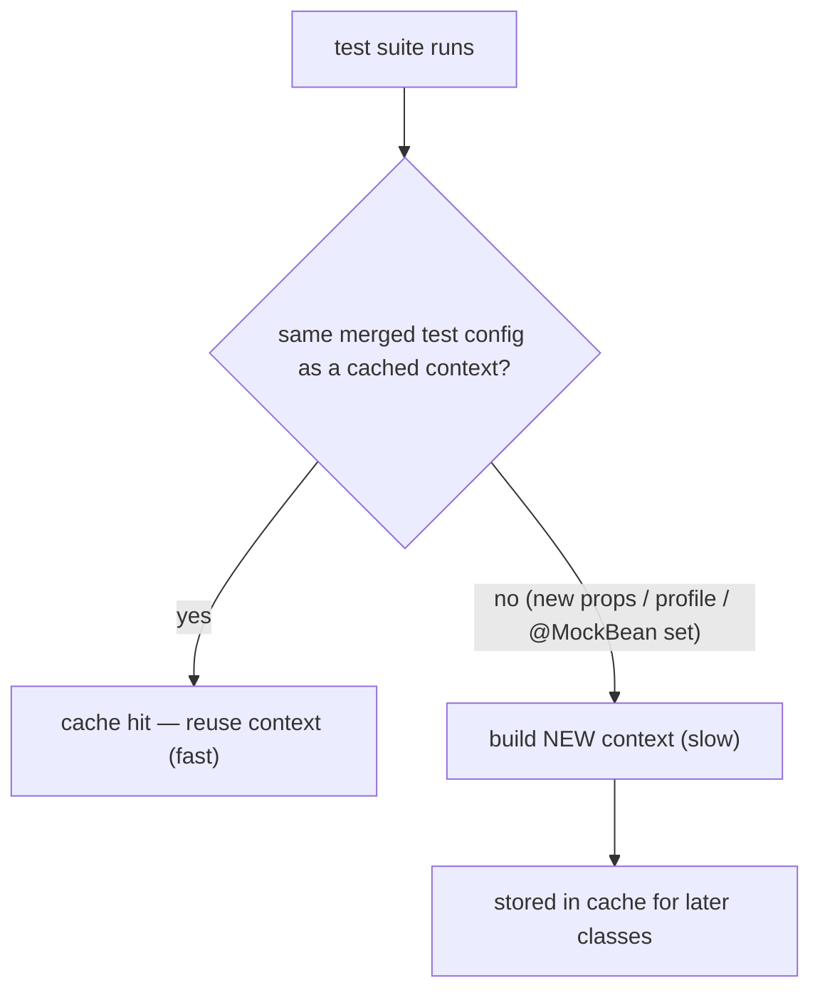

# 26 · Testing Spring Boot (Slices, Context Caching, Testcontainers)

> Boot tests are fast or slow for one dominant reason: **how many application contexts your suite
> builds.** Slices load focused contexts, the cache reuses identical ones — and `@MockBean` quietly
> busts that cache. Add Testcontainers for real dependencies and you have the whole testing story.
> [← Part 5 · Production](README.md) · prev: 25 · Actuator & Observability · next: 27 · Packaging & the Executable Jar

> **Predict first (2 min).** Your suite has 50 test classes, all `@SpringBootTest` with identical
> configuration. How many times does Spring build the application context? Now 10 of them each add a
> different `@MockBean` — how many contexts now? Write your guesses.

---

## The test pyramid, Boot edition

- **Plain unit tests** — no Spring at all: constructor-inject fakes ([ch.01](../00-foundations-the-container/)
  made this possible). The bulk of your tests; milliseconds each.
- **Slice tests** — a *focused* Spring context for one layer.
- **`@SpringBootTest`** — the full context; the closest to production and the most expensive. Use for
  wiring/integration confidence, not for logic coverage.

## Slices: load only the layer under test

Slice annotations auto-configure just one layer's beans and stub the rest:

| Slice | Loads | Typical partner |
|---|---|---|
| `@WebMvcTest(OrderController.class)` | MVC infra + that controller (no services/repos) | **`MockMvc`** to fire fake HTTP; `@MockBean` the service |
| `@DataJpaTest` | repositories + JPA + a test DB (in-memory by default) | `TestEntityManager`; flips to rollback-per-test |
| `@JsonTest` | Jackson setup only | assert serialization contracts |
| `@RestClientTest` | your REST client + `MockRestServiceServer` | test the client without a live server |

⚡ A `@WebMvcTest` answering "does this endpoint validate/serialize/route correctly?" runs in a
fraction of a full-context test — and *doesn't* touch the DB layer at all.

## Context caching: the real reason suites are slow (or fast)

Spring caches application contexts **across test classes**, keyed by the **test configuration** —
the merged set of config classes, properties, active profiles, context customizers…

The prediction's answers: 50 identical `@SpringBootTest` classes → **one** context built, 49 cache
hits. But each *distinct* configuration is a new cache entry, so 10 classes each adding a different
`@MockBean` → **10 more contexts** (11 total): **`@MockBean`/`@SpyBean` are part of the cache key**
— every unique mock combination is a new context boot.

- ⚡ The slow-suite diagnosis: count context startups in the log (each prints the banner/startup
  line). Many banners = your configurations differ needlessly.
- Fixes: standardize on a few **shared test configurations** (a common abstract base or shared
  `@TestConfiguration`), group tests that need the same mocks together, prefer slices, and stop
  sprinkling one-off `@TestPropertySource`/`@ActiveProfiles` variations.

## Testcontainers: real dependencies, not fakes

In-memory doubles (H2 standing in for Postgres) pass tests that fail in production — dialect,
DDL, and transaction semantics differ. **Testcontainers** starts the *real* thing in Docker per
suite:

```java
@SpringBootTest
@Testcontainers
class OrderRepoIT {
  @Container @ServiceConnection                       // Boot 3.1+: auto-wires url/user/password
  static PostgreSQLContainer<?> pg = new PostgreSQLContainer<>("postgres:16");
}
```

- **`@ServiceConnection`** (Boot 3.1+) replaces the old `@DynamicPropertySource` boilerplate: Boot
  sees the container type and configures the matching connection properties automatically.
- ⚡ Make the container **`static`** — one container per suite (reused across test classes with the
  singleton pattern), not one per test method.



## Make it visible

- **Count your contexts.** Run the suite and grep for the Spring banner / "Started" lines — that
  number, not test count, predicts suite time. Consolidate configs and watch it drop.
- **Bust the cache on purpose.** Add a `@MockBean` to one test class in a previously uniform suite —
  a fresh context boots just for it.
- **Catch an H2 lie.** Write a query using a Postgres-only feature (e.g. `ON CONFLICT`); green on H2,
  red on a Testcontainers Postgres — the reason real-DB tests exist.

## Self-Check (close the doc, answer out loud)

1. What does each slice (`@WebMvcTest`, `@DataJpaTest`, `@JsonTest`) load, and why is that faster than `@SpringBootTest`?
2. What exactly is the context-cache key, and how many contexts do 50 identical test classes build?
3. Why does `@MockBean` slow down suites, and what are two remedies?
4. What does `@ServiceConnection` do, and why prefer Testcontainers over H2 for data tests?
5. Where should the *bulk* of your tests sit, and what made plain unit tests possible in a Spring app?

> **Go deeper:** the Boot reference → "Testing" (slices list, caching rules); Testcontainers docs;
> then [27 · Packaging & the Executable Jar](README.md).
