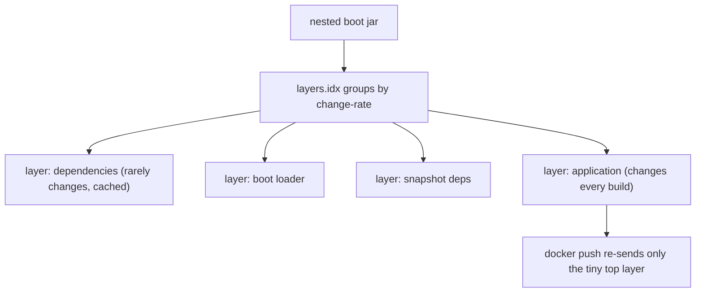

# 27 · Packaging, the Executable Jar & Deployment

> `java -jar app.jar` looks trivial, but the artifact behind it is a clever trick: a **nested jar**
> with its own launcher and classloader — deliberately *not* a shaded uber-jar. Understanding the
> layout explains layered Docker images, buildpacks, and a whole class of "works in IDE, breaks in
> jar" bugs.
> [← Part 5 · Production](README.md) · prev: 26 · Testing Spring Boot · next: 28 · AOT & Native Image

> **Predict first (2 min).** Plain `java -jar` can't read classes from a jar *inside* another jar —
> the JDK doesn't support nested-jar classloading. Yet Boot's fat jar contains all its dependency jars
> *whole* and runs fine. How? And why not just unpack everything into one giant jar (shading)? Write
> your guesses.

---

## The nested executable jar: layout and launcher

Unzip a Boot jar (`jar tf app.jar`):

```
app.jar
├── org/springframework/boot/loader/…      ← the Boot LOADER (plain classes, JDK-readable)
├── META-INF/MANIFEST.MF                    ← Main-Class: …JarLauncher
│                                             Start-Class: com.example.App (your main)
└── BOOT-INF/
    ├── classes/                            ← YOUR compiled code
    ├── lib/*.jar                           ← dependencies as WHOLE, untouched jars
    ├── classpath.idx                       ← classpath order
    └── layers.idx                          ← layer mapping (for Docker)
```

The prediction's first answer: the JDK runs the **`JarLauncher`** (at the jar root, so plain
`java -jar` *can* load it), and the launcher installs a **custom classloader** (`LaunchedClassLoader`)
that knows how to read classes **from jars nested inside the outer jar**, then calls your
`Start-Class`'s `main`. Boot didn't bend the JDK rule — it shipped a loader that implements
nested-jar reading itself.

## Why nested beats shaded (uber-jar)

The alternative — **shading** — unpacks every dependency and merges all classes into one flat jar.
Boot deliberately doesn't, the prediction's second answer:

- **File collisions:** two deps both shipping `META-INF/services/...` or the same resource path
  overwrite each other in a flat merge — classic shaded-jar breakage. Nested keeps each jar intact.
- **Provenance:** with whole jars you can still see *which dependency* a class came from
  (and its signature/manifest); shading destroys that.
- ⚡ The cost: some tooling that expects a flat classpath (`Class.getProtectionDomain` tricks, badly
  written resource scanning) needs the Boot loader's URLs — the "works in IDE, fails in jar" class of
  bug is usually code assuming `file:` URLs instead of nested `jar:` URLs.

## Layered jars: Docker-cache-friendly images

A naive Dockerfile `COPY app.jar` invalidates the whole image layer on **any** change. Boot's
**`layers.idx`** splits the jar by change-rate:

```
dependencies          ← changes rarely      (biggest, cached)
spring-boot-loader    ← almost never
snapshot-dependencies ← sometimes
application           ← every build         (smallest, top layer)
```

`java -Djarmode=tools -jar app.jar extract --layers` (3.3+; formerly `jarmode=layertools`) splits
them so each becomes its own Docker layer — pushing a one-line code change re-uploads **kilobytes,
not the 80MB of dependencies**. Or skip the Dockerfile entirely: **Cloud Native Buildpacks** via
`./gradlew bootBuildImage` / `mvn spring-boot:build-image` produce a layered, hardened OCI image with
a JVM picked for you — no Dockerfile to maintain.



## The odd cousins: WAR and `PropertiesLauncher`

- **WAR** (`war` packaging + `SpringBootServletInitializer`): only for deploying *into* a legacy
  shared servlet container ([ch.15](../02-spring-boot-core/) inverted back). Executable jar is the
  default; WAR is the compatibility escape hatch.
- **`PropertiesLauncher`**: a launcher variant whose classpath is configurable via `loader.path` —
  for "jar + external plugins/config directory" layouts.

## Make it visible

- **Dissect the jar.** `jar tf app.jar | head -50` — find the loader classes at the root,
  your code under `BOOT-INF/classes`, whole dependency jars under `BOOT-INF/lib`, and read
  `MANIFEST.MF`'s `Main-Class` vs `Start-Class`.
- **Extract the layers.** `java -Djarmode=tools -jar app.jar extract --layers` — four directories,
  by change-rate. Build the corresponding multi-`COPY` Dockerfile and watch rebuild pushes shrink.
- **Buildpack it.** `./gradlew bootBuildImage`, then `docker inspect` the image layers — same
  change-rate structure, no Dockerfile written.

## Self-Check (close the doc, answer out loud)

1. Sketch the nested-jar layout: where do the loader, your code, and dependencies live?
2. How does `java -jar` end up running your `main` if the JDK can't read nested jars?
3. Give two reasons Boot chose nesting over shading, and the classic bug the nested URLs cause.
4. What problem do layered jars solve, and what are the four default layers ordered by?
5. When would you still build a WAR, and what does `PropertiesLauncher` add?

> **Go deeper:** the Boot reference → "The Executable Jar Format" and "Container Images"; unzip a
> real app jar; then [28 · Boot 3 AOT & GraalVM Native Image](README.md) — the other end of the
> packaging spectrum.
