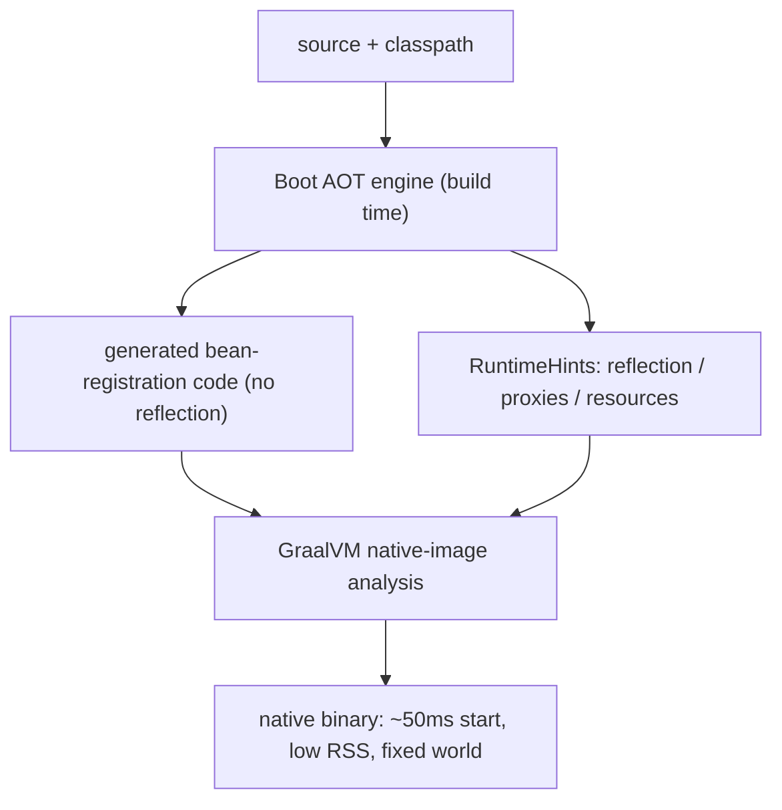

# 28 · Boot 3 AOT & GraalVM Native Image

> Native image assumes a **closed world** — but Spring's whole container runs on reflection, proxies,
> and runtime bean resolution. Boot 3's **AOT engine** squares that circle: it runs the container's
> *decisions* at build time and emits plain code + hints that survive the closed world.
> [← Part 5 · Production](README.md) · prev: 27 · Packaging & the Executable Jar

> **Predict first (2 min).** Component scanning, `@Conditional` evaluation, and `@Autowired`
> resolution all happen at *startup* via reflection ([Part 0](../00-foundations-the-container/)).
> Native image forbids discovering things at runtime. So what must Boot do with those three
> mechanisms to make a native Spring app possible — and *when* must it happen? Write your guess.

---

## The collision: dynamic Spring vs the closed world

GraalVM native image ([java ch.28](../../java/05-io-interop-deployment/)) analyzes reachable code at
**build time** and compiles exactly that. Anything discovered dynamically — reflection, generated
proxies, classpath scanning, resources — is invisible to the analysis unless declared. Plain Spring
is *made of* those things: scanning finds beans, conditions pick configurations, DI resolves by
reflection, AOP generates proxies ([Parts 0–1](../00-foundations-the-container/)). Naïvely
native-imaging a Spring app fails immediately.

## The Boot AOT engine: run the container's decisions at build time

The prediction's answer: Boot **moves the container's decision-making to build time**. During
`./gradlew nativeCompile` (or `mvn -Pnative native:compile`), the AOT engine:

1. **Boots a build-time model of the context** — runs component scanning, evaluates
   `@Conditional`s ([ch.11](../02-spring-boot-core/)), resolves the bean graph — everything
   `refresh()` would decide at startup ([ch.02](../00-foundations-the-container/)).
2. **Emits plain Java code** — generated `BeanDefinition`-registration classes that construct and
   wire your beans **without reflection** (direct `new` + setter calls, effectively the wiring code
   you never wrote, now written for you).
3. **Emits `RuntimeHints`** — a manifest of what *must* stay dynamic: reflection entries, JDK/CGLIB
   **proxy** classes (pre-generated at build time), resources, serialization. Native image's analyzer
   consumes these as reachability metadata.

**The consequence:** the world is **frozen at build time**. Profile-dependent beans, `@Profile`
switches, and conditions can't re-evaluate at runtime — what the AOT run decided is what ships.
(⚡ Set the *same* profiles at build time that you'll run with; a profile flag at runtime that would
change the bean graph is exactly what AOT can't honor.)

- ⚡ Custom dynamic tricks (hand-rolled reflection, runtime bytecode generation) need **your own
  hints** — implement `RuntimeHintsRegistrar`. Popular libraries increasingly ship theirs
  (the Spring team maintains reachability metadata for the common ecosystem).
- The AOT-generated code also speeds up **JVM** startup (Boot can use it without native image —
  "AOT mode on the JVM") — a middle rung on the [startup spectrum](../../java/05-io-interop-deployment/).

## The trade, restated for Boot apps

| | JVM Boot app | Native Boot app |
|---|---|---|
| startup | seconds | **~50ms** |
| memory (RSS) | hundreds of MB | **tens of MB** |
| peak throughput | **higher (JIT)** | lower, fixed |
| warmup | minutes to peak | **none** |
| build | seconds | **minutes** (analysis) |
| flexibility | profiles/conditions at runtime | **frozen at build time** |
| fit | long-running services | serverless, CLI, scale-to-zero |

Same spectrum as the [java startup-vs-peak chapter](../../java/05-io-interop-deployment/) — with one
Spring-specific addition: the **programming-model freeze**. Choose per workload; don't pay the
native-image constraints for a 24/7 service that would have amortized its warmup anyway.

## Make it visible

- **Read the generated code.** Run `./gradlew processAot`, then open
  `build/generated/aotSources` — find the `__BeanDefinitions` classes: your container wiring as
  plain, reflection-free Java. The "no magic" claim, in files.
- **Build one native app.** `./gradlew nativeCompile` a small Boot service: note the multi-minute
  build, then the ~50ms startup line and tiny RSS. Compare `time`/`ps` against the jar.
- **Break the closed world.** Add `Class.forName(someRuntimeString)` with no hint — native build or
  first call fails; add a `RuntimeHintsRegistrar` entry and watch it work.

## Self-Check (close the doc, answer out loud)

1. Why does plain Spring collide with native image's closed-world assumption? Name three colliding mechanisms.
2. What three things does the Boot AOT engine emit, and *when* does the container decide its bean graph?
3. Why can't `@Profile`/`@Conditional` re-evaluate at runtime in a native app, and what's the operational rule?
4. What are `RuntimeHints`, and when must you write your own?
5. Restate the JVM-vs-native trade for a Boot app — and which workloads justify the freeze?

> **Go deeper:** the Boot reference → "GraalVM Native Images" and "Ahead-of-Time Processing"; the
> `RuntimeHints` API docs; the [java startup chapter](../../java/05-io-interop-deployment/). 🎉 This
> closes **spring Part 5 · Production**.
