# Spring & Spring Boot — The Last-Minute Crash Course

> Every topic in the [spring-boot track](README.md), explained in plain English so you can absorb
> it in one sitting. Where the [CHEATSHEET](CHEATSHEET.md) is compressed for *recall*, this is
> written for *understanding fast* — read it top to bottom in ~45–60 minutes the night before you
> need it. Each topic ends with **One line to remember**. Targets Spring Boot 3.x / Spring 6.

---

## Part 0 · Foundations — The Container

### 1. What Spring is: IoC, DI & the container
Without Spring, your objects build their own dependencies with `new`, which welds them to
concrete classes and makes testing painful. **Inversion of control** flips it: you *describe*
your objects and their needs, and a **container** constructs and wires them. **Dependency
injection** is the specific mechanism — dependencies are handed in (ideally through the
constructor) rather than looked up. Everything else in Spring — AOP, transactions, Boot — is
built on top of this one idea.

**One line to remember:** you describe beans and their dependencies; the container constructs and wires them — that's all Spring is at its core.

### 2. ApplicationContext & BeanFactory
`BeanFactory` is the bare container: it holds bean definitions and creates beans on demand.
`ApplicationContext` is the superset everyone actually uses: it adds eager singleton creation,
events, i18n, resource loading, and — crucially — automatic registration of post-processors. Its
**`refresh()`** method is the bootstrap spine: prepare the bean factory → run
`BeanFactoryPostProcessor`s → register `BeanPostProcessor`s → instantiate every singleton →
publish "ready." Almost every Spring question ("when does X happen?") is answered by pointing at
a step of `refresh()`.

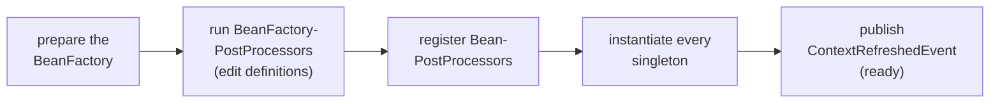

**One line to remember:** `ApplicationContext.refresh()` is the master sequence — post-process definitions, then instantiate all singletons.

### 3. Bean definitions & component scanning
The container doesn't store your objects at first — it stores **`BeanDefinition`s**: metadata
records saying "class, scope, dependencies, init method." `@Component` (found by
`@ComponentScan` classpath scanning), `@Bean` methods, and XML are just three *sources* of the
same metadata. This two-phase design (collect all definitions first, instantiate later) is what
lets frameworks rewrite the recipe before any object exists.

**One line to remember:** Spring first builds a catalog of *recipes* (`BeanDefinition`s) — objects come later, which is why the recipes can be rewritten.

### 4. The bean lifecycle & scopes
One bean's creation, in order: **instantiate → populate dependencies → `*Aware` callbacks →
`BeanPostProcessor` before-init → `@PostConstruct` → `afterPropertiesSet` → init-method →
`BeanPostProcessor` after-init (AOP proxies appear here) → in use → `@PreDestroy` on shutdown.**
The practical rules: dependencies aren't injected yet in the constructor (use `@PostConstruct`
for setup needing them), and the object other beans receive may be a *proxy* wrapped in the last
step. Scopes: **singleton** (default — one instance, so it must be stateless or thread-safe),
**prototype** (new instance per request to the container, and Spring never destroys it), plus
web scopes (request/session). Injecting a prototype into a singleton freezes one instance
forever — fix with `ObjectProvider` or a scoped proxy.

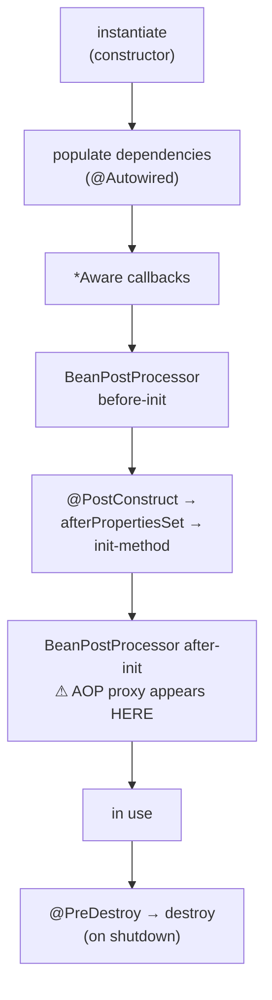

**One line to remember:** construct → inject → `@PostConstruct` → post-processors (proxies!) — and singletons must be stateless.

### 5. DI internals & circular dependencies
Constructor injection wins: dependencies are explicit, final, present before any method runs, and
the bean is testable with plain `new`. Field injection hides dependencies and needs reflection.
Circular dependencies: with **constructor** injection a cycle is impossible to satisfy — Spring
throws `BeanCurrentlyInCreationException`; with setter/field injection Spring *used to* squeak
through using its **three-level singleton cache** (exposing a half-built bean early). Boot 2.6+
**prohibits cycles by default** — the right response to the error is to break the cycle (extract
the shared piece), not to flip `allow-circular-references`.

**One line to remember:** prefer constructor injection; a circular-dependency error is a design smell to fix, not a flag to flip.

---

## Part 1 · Extension & AOP

### 6. BeanPostProcessor & BeanFactoryPostProcessor
The two hooks that *make Spring Spring*. **`BeanFactoryPostProcessor`** runs before any bean
exists and edits the *definitions* (this is how property placeholders get resolved).
**`BeanPostProcessor`** intercepts every bean after construction and may return a *replacement*
object — this is how `@Autowired` gets processed and how AOP swaps your bean for a proxy.
Understand these two and Spring stops being magic: nearly every annotation is implemented by one
of them.

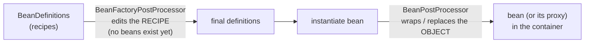

**One line to remember:** BFPP edits bean recipes before creation; BPP wraps or replaces beans after — `@Autowired`, AOP, and friends are just post-processors.

### 7. Spring AOP: JDK vs CGLIB proxies
Spring AOP doesn't rewrite your bytecode — it wraps your bean in a **proxy** that runs
interceptors around method calls. Two flavors: **JDK dynamic proxies** (implement the same
interfaces) and **CGLIB** (subclass your class — the Boot default). CGLIB's limits follow from
"it's a subclass": `final` classes/methods and private methods can't be proxied. The trap that
follows everyone forever — **self-invocation**: a call from one method to another *inside the
same bean* (`this.otherMethod()`) never passes through the proxy, so `@Transactional`, `@Async`,
`@Cacheable` on the inner method **silently do nothing**.

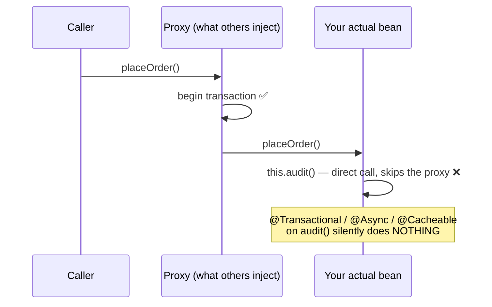

**One line to remember:** AOP = a proxy around your bean, so internal `this.method()` calls bypass every annotation — the self-invocation trap.

### 8. Environment, properties & binding
All configuration flows through the `Environment`: an *ordered* list of `PropertySource`s
(command line beats env vars beats `application.yml`…), first match wins. Two consumption styles:
`@Value("${my.prop}")` for one-offs, and **`@ConfigurationProperties(prefix="app")`** binding a
whole prefix onto a typed (ideally record) object with validation — always prefer the latter for
related settings. **Relaxed binding** maps `MY_APP_TIMEOUT-MS` ↔ `my.app.timeout-ms` across
formats. **Profiles** (`dev`, `prod`) activate bean subsets and profile-specific property files.

**One line to remember:** properties come from an ordered list of sources (first wins); bind groups of them type-safely with `@ConfigurationProperties`.

### 9. Events
Spring ships an in-process event bus: publish with `ApplicationEventPublisher`, listen with
`@EventListener` on any bean method. Default delivery is **synchronous, on the caller's thread**
— the publisher waits for every listener, shares its transaction, and a listener exception
propagates back. Add `@Async` to decouple, and use `@TransactionalEventListener(AFTER_COMMIT)`
for the killer pattern: "send this notification only if the transaction commits."

**One line to remember:** events are synchronous by default; `@TransactionalEventListener(AFTER_COMMIT)` is the pattern for post-commit side effects.

---

## Part 2 · Spring Boot Core

### 10. What Boot adds
Boot is **not a new framework** — it's opinionated defaults layered on plain Spring: starters (a
dependency menu), auto-configuration (beans conditionally pre-wired), an embedded server (the
app *contains* Tomcat instead of deploying into it), and Actuator (production endpoints). The
mental shift: instead of configuring everything, you override *only what differs from the
defaults*.

**One line to remember:** Boot = plain Spring + opinionated defaults; you only configure the deltas.

### 11. Auto-configuration internals
`@SpringBootApplication` includes `@EnableAutoConfiguration`, which imports every class listed in
`META-INF/spring/...AutoConfiguration.imports` from your dependencies (the modern file — the old
`spring.factories` mechanism is gone). Each auto-config class is fenced with **`@Conditional`**
guards: `@ConditionalOnClass` (is the library on the classpath?), **`@ConditionalOnMissingBean`**
(has the user defined their own?), `@ConditionalOnProperty`. That last one is the whole
politeness contract: *your* bean definition automatically switches the default off. Debug what
fired and why with the Actuator `/conditions` endpoint or `--debug`.

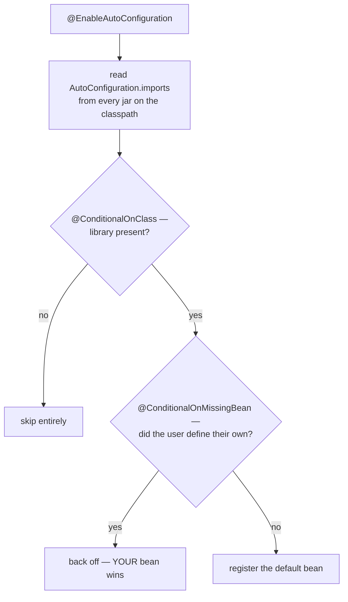

**One line to remember:** auto-configuration = imported config classes gated by conditions, and `@ConditionalOnMissingBean` means your bean always wins.

### 12. Starters & dependency management
A starter (`spring-boot-starter-web`) is usually **just a curated POM** — a bundle of compatible
dependencies, no code. The magic pairing: the starter puts a library on the classpath, and
auto-configuration reacts to it being there. Versions come from the `spring-boot-dependencies`
BOM, which is why your `pom.xml` has no version numbers on Spring-managed artifacts — and why you
shouldn't pin your own.

**One line to remember:** a starter is a curated dependency list; classpath presence triggers matching auto-configuration.

### 13. The SpringApplication startup sequence
`SpringApplication.run()` in order: deduce the app type (servlet/reactive/none from the
classpath) → prepare the `Environment` (all property sources) → print banner → create the right
`ApplicationContext` → `prepareContext` (register your primary sources) → **`refreshContext`** —
the plain-Spring `refresh()` from topic 2, during which auto-configurations import, all
singletons build, and **the embedded web server starts** → then `ApplicationRunner` /
`CommandLineRunner` callbacks. So "when is my app ready?" = end of refresh; startup-time code
goes in a runner.

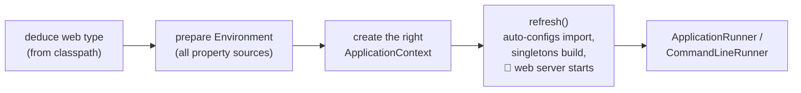

**One line to remember:** `run()` builds the environment, then delegates to plain `refresh()` — the web server starts *inside* refresh, and runners fire after.

### 14. Externalized configuration
The same jar must run in every environment, so config lives outside the code. Precedence, highest
first: command-line args → env vars → profile-specific files (`application-prod.yml`) →
`application.yml` inside the jar. Files *outside* the jar beat files inside. Practical setup:
defaults in `application.yml`, per-environment overrides via profile files or environment
variables (the container/cloud-native way).

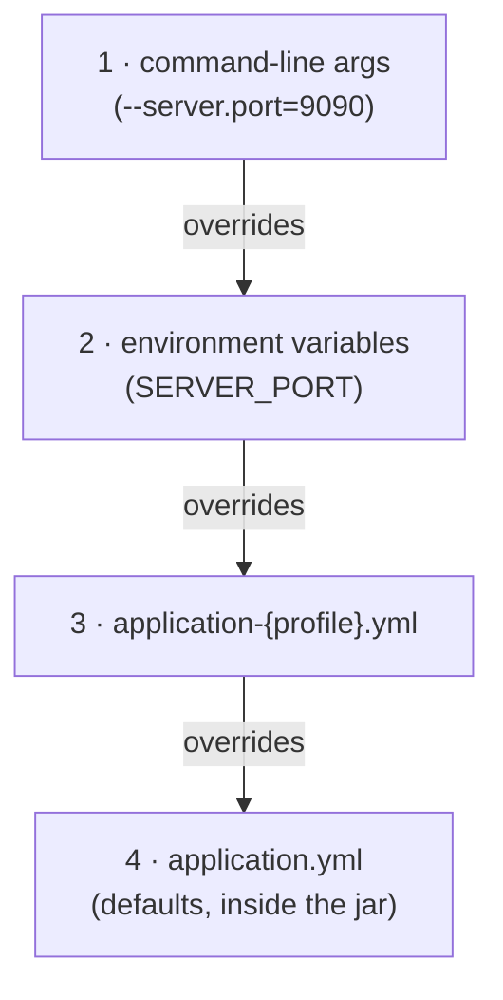

**One line to remember:** one artifact, many environments — command line > env vars > profile files > application.yml.

### 15. Embedded servers
Boot inverts deployment: instead of a WAR dropped into a server, the **app owns the server** —
`refresh()` creates a `WebServerFactory` bean and starts Tomcat (default; swap the starter for
Jetty/Undertow/Netty) on the configured port. Customize via `server.*` properties first, a
`WebServerFactoryCustomizer` bean when properties don't reach. This is what makes
`java -jar app.jar` a complete deployable — the foundation of container-friendly deployment.

**One line to remember:** the app contains the server (started inside `refresh()`), not the other way around.

---

## Part 3 · Web: MVC & Reactive

### 16. Spring MVC: the DispatcherServlet
Every request hits **one servlet** — the `DispatcherServlet` — which orchestrates strategy
objects: a `HandlerMapping` finds which controller method matches; interceptors run *before*
around it; `HandlerMethodArgumentResolver`s build the method arguments (`@PathVariable`,
`@RequestBody` via an `HttpMessageConverter` like Jackson…); the method runs; the return value is
written back through a converter (REST) or a `ViewResolver` (templates). The model is
**blocking, thread-per-request**: one pool thread is held for the whole request — fine until
threads run out waiting on slow I/O.

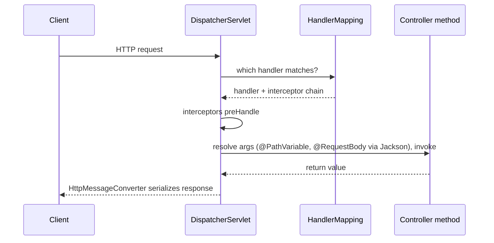

**One line to remember:** one front controller dispatches to strategies (mapping → resolve args → invoke → convert result), one thread held per request.

### 17. Building REST APIs
`@RestController` = `@Controller` + `@ResponseBody` — return values are serialized (Jackson)
instead of rendered as views. Validate input declaratively: `@Valid @RequestBody` + constraint
annotations on the DTO (`@NotBlank`, `@Email`…). Handle errors in **one place**: a
`@ControllerAdvice` class with `@ExceptionHandler` methods mapping exceptions to
**`ProblemDetail`** (RFC 7807) responses — never let stack traces leak, never scatter try/catch
through controllers. Use proper status codes: 201 + Location on create, 400 validation, 404
missing, 409 conflict.

**One line to remember:** thin controllers, `@Valid` on input DTOs, and all error handling centralized in one `@ControllerAdvice`.

### 18. WebFlux & reactive
WebFlux replaces thread-per-request with an **event loop** (Reactor Netty, a few threads):
`Mono<T>` (0–1 value) and `Flux<T>` (0–N) are lazy pipelines that describe work, and
**backpressure** lets consumers control the producer's rate. The honest assessment: reactive
only pays when the **whole stack is non-blocking** (R2DBC, WebClient — one blocking JDBC call
poisons the event loop), and the price is harder debugging and stack traces. With virtual
threads now making blocking code scale, the niche is narrower: choose it for streaming,
backpressure-sensitive, or extreme-concurrency workloads — not as a default speedup.

**One line to remember:** reactive = event loop + backpressure; it only wins end-to-end non-blocking, and virtual threads shrank its niche.

### 19. Filters, interceptors & virtual threads
Three interception layers, outermost first: servlet **`Filter`** (before Spring — auth, CORS,
the Security filter chain lives here) → Spring **`HandlerInterceptor`** (knows *which handler*
will run — logging, tenant context) → **AOP** (method-level, not just web). WebFlux's equivalent
is `WebFilter`. The third threading option since Boot 3.2:
**`spring.threads.virtual.enabled=true`** runs each request on a virtual thread — blocking style
that scales like async, one property, no code change. Prefer it over rewriting to reactive when
the bottleneck is threads blocked on I/O.

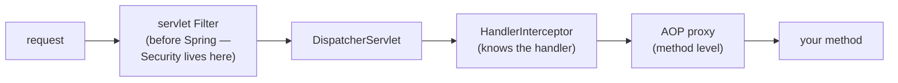

**One line to remember:** Filter (servlet) → Interceptor (Spring) → AOP (method), and one property turns on virtual threads for MVC.

---

## Part 4 · Data & Transactions

### 20. Spring Data & repositories
You write an interface — `interface UserRepo extends JpaRepository<User, Long>` — and Spring Data
generates a **dynamic proxy** implementation at runtime. Method names compile to queries
(`findByEmailAndActiveTrue`); anything complex gets explicit `@Query`. Return `Page<T>` with a
`Pageable` for pagination, and use **projections** (interfaces/records) to fetch only needed
columns. The abstraction leaks by design — when it does, drop to `@Query` or `JdbcTemplate`
rather than fighting method-name gymnastics.

**One line to remember:** repositories are runtime-generated proxies — method names become queries; go explicit when derivation gets awkward.

### 21. JPA/Hibernate & the persistence context
The **persistence context** is a per-transaction map of loaded entities — the first-level cache.
Entities you load are *managed*: Hibernate snapshots them, detects your mutations (**dirty
checking**), and flushes UPDATEs at commit — you rarely call `save()` on a managed entity.
**Lazy loading** returns proxies that fetch on first access — touch one after the transaction
closed and you get `LazyInitializationException`. The classic killer is **N+1**: load N orders,
then touch each `.customer` → N extra queries; fix with `join fetch` or `@EntityGraph`. Always
log SQL in dev — the ORM hides the query count from you.

**One line to remember:** entities are tracked in a per-transaction cache with dirty checking — and watch for lazy-loading N+1 queries.

### 22. Transaction management internals
`@Transactional` works through the AOP proxy: a `TransactionInterceptor` begins a transaction
(via `PlatformTransactionManager`), invokes your method, commits on success, rolls back on
failure. Two facts everyone gets burned by: (1) rollback happens **only for unchecked
exceptions** by default — checked exceptions commit! (`rollbackFor = Exception.class` to change);
(2) **self-invocation bypasses it** — `this.transactionalMethod()` runs with no transaction at
all (topic 7). Propagation: `REQUIRED` (default, join or create), `REQUIRES_NEW` (suspend and
start fresh — for audit logs that must survive rollback). Keep transactions short; don't call
slow remote services while holding one (and a DB connection).

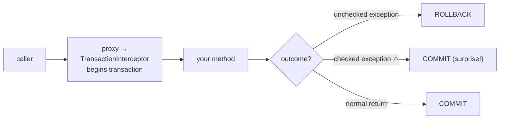

**One line to remember:** `@Transactional` is a proxy — self-invocation skips it, and checked exceptions don't roll back by default.

### 23. JDBC, pooling & caching
Under everything sits **HikariCP**, the default connection pool. The knobs that matter:
`maximum-pool-size` (small is beautiful — often ~10; more connections ≠ more throughput) and
`connection-timeout` (how long a thread waits for a connection — when the pool exhausts, requests
queue here and the app "hangs"). For SQL without JPA: `JdbcTemplate` / `JdbcClient` (Boot 3.2+,
fluent). Caching: `@Cacheable`/`@CacheEvict` wrap methods via — again — a proxy (same
self-invocation trap), backed by whatever `CacheManager` you drop in (Caffeine locally, Redis
shared).

**One line to remember:** HikariCP with a *small* pool; pool exhaustion looks like a hung app; `@Cacheable` is another proxy with the same trap.

---

## Part 5 · Production

### 24. Spring Security: the filter chain
Security is a chain of **servlet filters** running before the DispatcherServlet:
`DelegatingFilterProxy` → `FilterChainProxy` → an ordered `SecurityFilterChain` (CORS → CSRF →
authentication filters → authorization last). Authentication ends up in the thread-local
**`SecurityContext`**. Since Security 6 you configure it as a **`SecurityFilterChain` `@Bean`**
with the lambda DSL (`http.authorizeHttpRequests(...)`) — `WebSecurityConfigurerAdapter` is
removed. For stateless APIs: `oauth2ResourceServer().jwt()`, session policy STATELESS, CSRF off.
Method-level: `@PreAuthorize` (a proxy — self-invocation trap applies here too).

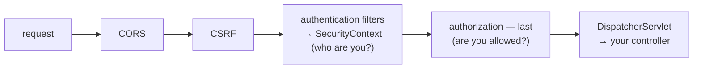

**One line to remember:** security = an ordered filter chain before MVC, configured as a `SecurityFilterChain` bean; authenticate first, authorize last.

### 25. Actuator & observability
Actuator exposes operational endpoints: `/health` (with liveness/readiness probes for
Kubernetes), `/metrics` (via **Micrometer**, the "SLF4J of metrics" — one API, exporters for
Prometheus etc.), and the debugging trio — **`/conditions`** (why auto-config did or didn't
fire), **`/beans`**, **`/mappings`**. Boot 3 uses **Micrometer Tracing** for distributed traces
(Sleuth is dead). Security rule: expose only what you need (`management.endpoints.web.exposure.include`)
and lock the rest behind auth — Actuator leaks are a classic pentest finding.

**One line to remember:** Actuator + Micrometer = health, metrics, and traces for free — expose deliberately, and use `/conditions` as your auto-config debugger.

### 26. Testing
The speed lever is **context caching**: Spring caches the `ApplicationContext` across test
classes *keyed on the configuration* — every unique `@MockBean`/`@ActiveProfiles`/property combo
forces a fresh multi-second context build. So standardize test configurations. Prefer **slices**
over full `@SpringBootTest`: `@WebMvcTest` (controllers + MockMvc, no DB), `@DataJpaTest`
(repositories + rollback per test). Test against a **real database with Testcontainers** —
H2-vs-Postgres differences produce false green; `@ServiceConnection` (Boot 3.1+) wires the
container's URL automatically.

**One line to remember:** slices over full-context tests, identical test configs to keep the context cache hot, Testcontainers over H2.

### 27. Packaging & deployment
`java -jar app.jar` works because Boot builds a **nested** executable jar — your classes in
`BOOT-INF/classes/`, dependencies as *intact jars* in `BOOT-INF/lib/`, loaded by `JarLauncher`
(not a flattened uber-jar — no file-collision problems). For containers, **layered jars** split
dependencies (change rarely) from your code (changes always) so Docker rebuilds only the top
layer; or skip the Dockerfile entirely with buildpacks
(`./gradlew bootBuildImage`).

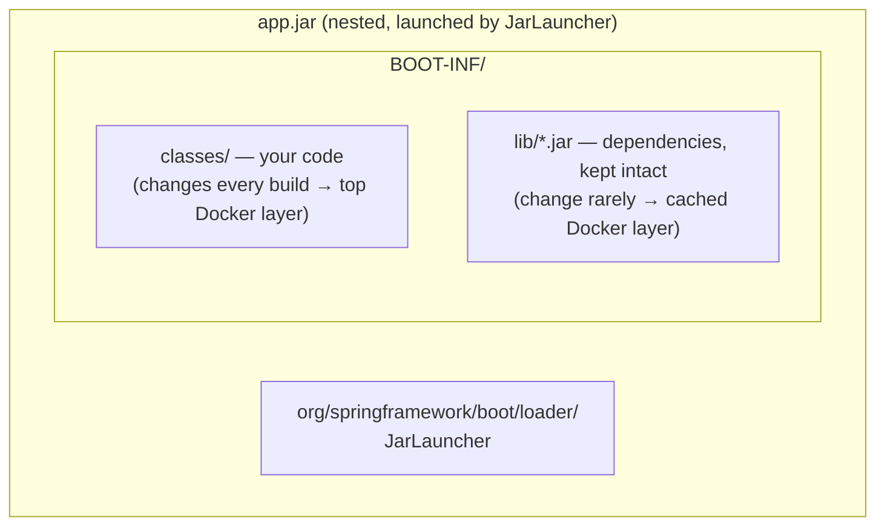

**One line to remember:** the executable jar is a jar-of-jars; layer it in containers so dependency layers cache across builds.

### 28. AOT & GraalVM native image
Native image compiles the app to a **binary** at build time: ~50 ms startup, a fraction of the
memory — but a **closed world**: no runtime classpath scanning, and every use of reflection,
proxies, or resources must be known at build time. Boot's **AOT processing** bridges the gap: at
build time it runs your bean-definition phase and generates plain-Java registration code plus
`RuntimeHints` for the reflective bits. Costs: no JIT (lower peak throughput), slow builds,
runtime-conditional beans (`@Profile` switching) get baked in at build time. Right tool for
serverless, scale-to-zero, and CLIs — not a universal upgrade.

**One line to remember:** AOT moves bean wiring to build time so native image can work — instant startup, closed world, no JIT peak.

---

## Part 6 · Principal Skills

### 29. Performance & tuning
First separate the problem: startup time, request latency (look at p99, not average), and
throughput are different problems with different fixes. Then find the *actual* bottleneck with
evidence — Actuator/Micrometer metrics, HikariCP pool stats, SQL logs — before touching anything.
The usual suspects in a Boot app, in order: **N+1 queries, pool exhaustion, missing indexes,
oversized contexts, blocking calls on hot paths** — the JVM itself is rarely the problem. One
change, re-measure, keep or revert.

**One line to remember:** p99 with evidence, not averages with folklore — and the bottleneck is usually the database access pattern.

### 30. Architecture with Spring — and when not to use it
Spring's seams — events for decoupling, post-processors for cross-cutting registration, proxies
for cross-cutting behavior — are powerful; use them *deliberately*, not by default. DI helps
until it hides coupling (a bean with 10 dependencies is a design problem DI is masking). Prefer a
**modular monolith** (enforce module boundaries, e.g. Spring Modulith) until organizational
pressure — independent deploys, independent scaling — genuinely demands services. And plain Java
(a `record`, a plain class, a standard library call) is often the better tool than another
Spring abstraction.

**One line to remember:** use Spring's seams deliberately; a modular monolith first; plain Java when a framework feature adds nothing.

### 31. Reading the source
The Spring codebase is genuinely readable and instrumented with debug logging. When behavior
surprises you: read the reference docs first, then put a breakpoint in
`AbstractApplicationContext.refresh()` or `AbstractAutowireCapableBeanFactory.doCreateBean()` and
step through — the answer to "why is my bean like this?" is always in there. Follow release notes
and the Spring blog for what changes between versions.

**One line to remember:** when Spring surprises you, the source is the documentation — start at `refresh()`.

---

## If you only remember ten things

1. The container builds a catalog of `BeanDefinition`s first, then instantiates singletons during `refresh()` — everything hangs off that sequence.
2. `BeanFactoryPostProcessor` edits recipes; `BeanPostProcessor` wraps beans — nearly every annotation is implemented by one of them.
3. AOP = proxies. Therefore **self-invocation silently disables** `@Transactional`, `@Async`, `@Cacheable`, `@PreAuthorize`.
4. Constructor injection; circular dependencies are design smells.
5. Auto-configuration is condition-gated defaults, and `@ConditionalOnMissingBean` means your bean wins. Debug with `/conditions`.
6. Config precedence: command line > env vars > profile files > `application.yml`. Bind groups with `@ConfigurationProperties`.
7. `@Transactional`: unchecked exceptions roll back, checked ones don't; keep transactions short.
8. The persistence context dirty-checks managed entities; hunt N+1 with SQL logging, fix with `join fetch`.
9. Small Hikari pool; exhaustion looks like a hung app. Virtual threads (`spring.threads.virtual.enabled=true`) beat a reactive rewrite for blocked-on-I/O.
10. Test with slices + a hot context cache + Testcontainers; secure with a `SecurityFilterChain` bean; observe with Actuator + Micrometer.
