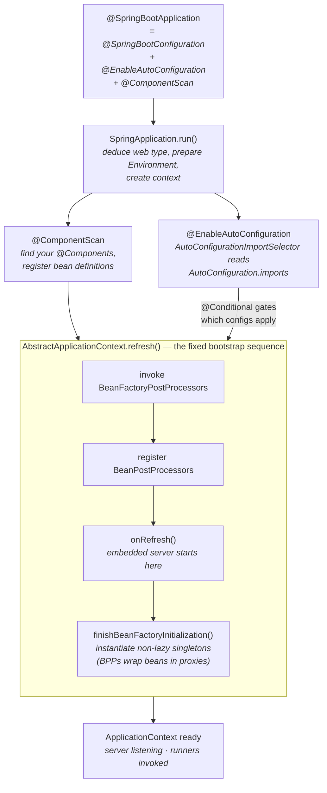

# Spring & Spring Boot, In Depth — From the Container Up to Principal

> A self-study curriculum that takes you from *writing Spring apps* to *reasoning about what the
> container and Boot actually do at runtime* — the way a principal engineer does. Built for a focused
> 3-month intensive, and built to be **seen**: every hard-to-picture process here has a Mermaid
> diagram or an interactive animation.

This is not another "learn the annotations" course, and it is not a tour of `@RestController` and
`@Autowired`. You already ship features on Spring Boot. The gap between you and a principal engineer
is **not** knowing more `@Annotations`; it is understanding *the machine underneath them* — the IoC
container, auto-configuration, and the proxy — well enough to **debug and reason from first
principles** when the magic stops behaving like magic.

A junior says *"my `@Transactional` method isn't committing — maybe I need `@EnableTransactionManagement`
or a flush."* A principal hears "called from another method of the same class," **immediately suspects
self-invocation bypassing the CGLIB proxy** (the call never leaves `this`, so the
`TransactionInterceptor` advice never runs), confirms it in thirty seconds by turning on
`logging.level.org.springframework.transaction=TRACE` and watching *no* transaction get created, and
fixes it by moving the call across a bean boundary — or restructuring so the entry point is the proxied
method. No guessing, no cargo-culted annotation. Everything here is built to grow that second voice in
your head — and to back it with something you can *see* in a log, an Actuator endpoint, or a breakpoint
on a real running context.

---

## Who this is for

You, specifically: an engineer in the **first couple of years** who can build a working Boot service
but treats Spring as a black box that "just wires things up." You want real depth — the container, the
bean lifecycle, dependency injection internals, the `BeanPostProcessor` extension model, proxies and
AOP, auto-configuration, the `DispatcherServlet`, transactions, Spring Data, Security, and native image
— **fast, and without the hand-waving.** The track **builds the container up from scratch** (what IoC
*is*, what a bean definition is, how the context bootstraps) before assuming any internals background,
then climbs all the way to auto-configuration internals, the reactive stack, transaction propagation,
the Security filter chain, and AOT/GraalVM native image.

If you're already comfortable with the `ApplicationContext` and the bean lifecycle, skim Part 0 and
start at Part 1.

> **Companion, not replacement, for the [java track](../java/).** This track stops at the boundary
> where Spring hands work to the JVM, and the java track picks it up: Spring AOP proxies are *JDK
> dynamic proxies and CGLIB* (java track: reflection, proxies, class loading); the `volatile`/
> happens-before reasoning behind a thread-safe singleton bean is the *Java Memory Model* (java track,
> Part 3); virtual-thread request handling in Boot 3.2 is *Project Loom* (java track, Part 3); and the
> startup-vs-peak trade-off behind native image is the java track's Part 5. When a "why" bottoms out in
> the JVM, this track links you there rather than re-deriving it. It also leans on the
> **[LLD track](../LLD/)** for *when an abstraction earns its keep* and the **[HLD track](../HLD/)** for
> the distributed concerns Boot apps run inside.

---

## How to use this (read this part — it's the difference between learning and skimming)

Reading these documents will make you *feel* knowledgeable. That feeling is a trap. But Spring has a
superpower the design tracks don't: **a running Spring context is a real machine you can interrogate**,
and — uniquely — **its source is famously well-structured and readable.** You never have to *believe* a
claim here; you can make the container *show you*. That makes the loop slightly different and far more
powerful:

1. **Predict, then read.** Before a writeup, spend 2 minutes guessing the answer to its title (*"why is
   my bean a CGLIB subclass and not the class I wrote?"*, *"what exactly does `@SpringBootApplication`
   expand to?"*, *"in what order do `@PostConstruct` and `afterPropertiesSet` run?"*). Reading to
   *check* a guess sticks far better than reading cold.
2. **Read actively.** Each writeup ends with a **Self-Check**. Close the doc and answer out loud, in
   your own words, as if explaining to a colleague. If you can't, you don't know it yet.
3. **Then *make it visible* on a real app.** This is the habit that separates this track from a blog
   binge. Spring's behavior is invisible by default — proxies, conditions, and wiring all happen behind
   the curtain — so the core skill is **pulling back the curtain.** Almost every claim here is
   verifiable with something you already have:
   - run with `--debug` (or set `debug=true`) to print the **`ConditionEvaluationReport`** — every
     auto-configuration, and *why* it matched or didn't,
   - hit the **Actuator** endpoints: `/actuator/beans` (every bean and its dependencies),
     `/actuator/conditions` (the condition report as JSON), `/actuator/mappings` (every URL → handler),
     `/actuator/configprops`, `/actuator/health`, `/actuator/metrics`,
   - turn on **proxy/AOP and transaction logging** (`logging.level.org.springframework.aop=TRACE`,
     `...transaction=TRACE`) to watch advice fire — or *not* fire,
   - set **breakpoints in the source**: `AbstractApplicationContext.refresh()` (the whole bootstrap),
     `DispatcherServlet.doDispatch()` (one request, end to end), `TransactionInterceptor.invoke()` (one
     transaction), `AutoConfigurationImportSelector` (what got imported),
   - and **read the Spring source** — it is exceptionally navigable, and reading it is itself the skill.

   When what you see surprises you — and it will — that gap *is* the learning. Reconcile it against the
   writeup and, when in doubt, against the reference docs and the source.
4. **Build one thing per part.** Reading about auto-configuration is one tenth of understanding it. The
   [ROADMAP](ROADMAP.md) gives each part a small hands-on artifact (write your own starter with an
   `AutoConfiguration` class and a `@Conditional`, reproduce a `BeanCurrentlyInCreationException` and
   then break the cycle, build a `SecurityFilterChain` from scratch, ship a GraalVM native image).
   Touching the real thing converts knowledge into intuition.

> **The single highest-ROI habit in this track: never trust a "Spring just does X" claim you didn't
> make the container confirm — including the ones in here.** "Verify against the primary source" is a
> principal habit; for Spring the primary sources are *the running context* (its logs and Actuator
> endpoints), *the source*, and *the reference documentation*.

The full method — predict → read → self-check → make it visible → build — is in
**[STUDY-METHOD.md](STUDY-METHOD.md)**. Read it before Week 1; it matters more than the chapter order.

### See it move — the visual layer

You asked for this to be **rich in graphics and animations**, and that's not decoration: the things
that make Spring confusing are mostly **invisible processes** — a `refresh()` walking its fixed
sequence, a `BeanPostProcessor` quietly swapping your bean for a proxy on the way out of the factory,
the three-level singleton cache resolving a circular reference mid-construction, a request fanning out
through the `DispatcherServlet` to a `HandlerAdapter` and back through an `HttpMessageConverter`. Static
prose undersells motion. So every such process gets a visual, in one of two media:

- **Mermaid diagrams**, inline in the markdown, for *structure* (the `refresh()` sequence, the bean
  lifecycle state machine, the Security filter chain).
- **Standalone interactive HTML animations**, in each part's `visualizations/` folder, for *dynamics*
  you can play, pause, step, and scrub — the boot sequence, a request through the dispatcher, the
  proxy intercepting a self-invocation. Self-contained single files — no build, no dependencies, no
  network. Just open in a browser.

The full approach and the catalog of planned animations is in **[VISUALIZATIONS.md](VISUALIZATIONS.md)**.

### The mental model everything rests on

`@SpringBootApplication` is three annotations in a trench coat. `SpringApplication.run()` figures out
what *kind* of app this is, builds an `ApplicationContext`, and calls the one method everything hinges
on: **`AbstractApplicationContext.refresh()`** — a *fixed, ordered* sequence that invokes
bean-factory post-processors, registers bean post-processors, starts the embedded web server
(`onRefresh`), and finally instantiates every non-lazy singleton (where post-processors quietly wrap
your beans in **CGLIB proxies**). Auto-configuration doesn't add a fourth magic step — it just
contributes more bean definitions, each **gated by `@Conditional`**, so your beans win when you define
them. Almost every "how did Spring know to do that?" question is really a question about *this path*.
Parts 0–2 take it apart completely.

---

## The curriculum

Work top to bottom — each part assumes the previous ones. The [ROADMAP](ROADMAP.md) sequences all of
this into 12 weeks; [STUDY-METHOD.md](STUDY-METHOD.md) is *how* to learn it fast (read it before Week 1
— it matters more than the order).

### [Part 0 — Foundations: The Container & IoC](00-foundations-the-container/) *(what every later idea rests on)*
What Spring *is* underneath the annotations, and what happens between "I declared a bean" and "the
object exists and is wired."
- **01 · What Spring Is: IoC, DI & the Container** — inversion of control vs dependency injection (not the same thing), why the container exists at all, and the shift from `new` to "describe it and let the container assemble it."
- **02 · ApplicationContext & BeanFactory** — `BeanFactory` as the core container, `ApplicationContext` as the superset that adds events, i18n, and post-processing; the `refresh()` bootstrap as the spine of everything.
- **03 · Bean Definitions & Component Scanning** — `BeanDefinition` as metadata (not the object), `@Component`/`@Bean`/XML as sources of it, how `@ComponentScan` finds candidates, and bean naming & overriding.
- **04 · The Bean Lifecycle & Scopes** — the exact ordered lifecycle (instantiate → populate → `*Aware` → `BeanPostProcessor` before-init → `@PostConstruct` → `afterPropertiesSet` → init-method → after-init → in use → `@PreDestroy` → `destroy`), singleton vs prototype vs web scopes, and why scope mismatches bite.
- **05 · Dependency Injection Internals & Circular Dependencies** — constructor vs setter vs field injection and why constructor wins, how the three-level singleton cache resolves cycles for setter injection, why constructor cycles throw `BeanCurrentlyInCreationException`, and why Boot 2.6+ prohibits circular references by default.

### [Part 1 — The Extension Model & AOP](01-extension-and-aop/) *(how Spring is built out of its own hooks)*
- **06 · BeanPostProcessor & BeanFactoryPostProcessor** — the two extension points that *make Spring Spring*: `BeanFactoryPostProcessor` rewrites bean definitions before instantiation; `BeanPostProcessor` wraps beans after; AOP, `@Autowired`, and `@Configuration` all ride these.
- **07 · Spring AOP: Proxies (JDK Dynamic vs CGLIB)** — proxy-based AOP, JDK dynamic proxies (interface-based) vs CGLIB (subclassing, the Boot default), what CGLIB can't proxy (`final`), and **the self-invocation trap** that silently disables `@Transactional`/`@Async`.
- **08 · The Environment, Properties & Configuration Binding** — the `Environment` and ordered `PropertySource`s, `@Value` vs `@ConfigurationProperties`, profiles, and how relaxed binding maps `MY_PROP` ↔ `my.prop`.
- **09 · Events & the Application Event Model** — `ApplicationEvent`/`ApplicationListener`, `@EventListener`, synchronous-by-default publishing, ordering, and `@Async` events — the in-process event bus you already have.

### [Part 2 — Spring Boot Core](02-spring-boot-core/) *(the opinions, and the machinery behind them)*
- **10 · What Boot Adds: Opinions, Starters & the Philosophy** — Boot as *opinionated defaults on top of plain Spring*, "convention over configuration," and the mental shift from "configure everything" to "override only what's non-default."
- **11 · Auto-Configuration Internals** — `@EnableAutoConfiguration` → `AutoConfigurationImportSelector` → `META-INF/spring/org.springframework.boot.autoconfigure.AutoConfiguration.imports` (the modern mechanism, **not** legacy `spring.factories`), the `@Conditional` family gating it, and how `@ConditionalOnMissingBean` lets your bean win.
- **12 · Starters & Dependency Management** — what a starter actually is (a curated POM of transitive deps, usually no code), the BOM and `spring-boot-dependencies` managing versions, and how to write your own starter + auto-configuration.
- **13 · The SpringApplication Startup Sequence** — `run()` step by step: deduce web type → `SpringApplicationRunListeners` → prepare `Environment` → banner → create context → `prepareContext` → `refreshContext` (server boots inside `refresh`) → `afterRefresh` → `ApplicationRunner`/`CommandLineRunner`.
- **14 · Externalized Configuration & Relaxed Binding** — the full property-source precedence order, `application.yml`/`.properties`, profiles, environment variables & command-line args, config import, and type-safe binding with validation.
- **15 · Embedded Servers** — embedded Tomcat (default) vs Jetty vs Undertow, where the server starts in `refresh()`, the `WebServerFactory` customization hooks, and what "no external container" really changes.

### [Part 3 — Web: MVC, REST & Reactive](03-web-mvc-and-reactive/) *(serving requests, two ways)*
- **16 · Spring MVC Internals: the DispatcherServlet** — the one front controller, the `HandlerMapping` → `HandlerAdapter` flow with `HandlerInterceptor`s, `HandlerMethodArgumentResolver`s, `HttpMessageConverter`s, and `ViewResolver`s; blocking, thread-per-request.
- **17 · Building REST APIs: Negotiation, Errors & Validation** — `@RestController`/`@ResponseBody` and message conversion, content negotiation, Bean Validation (`jakarta.validation`), and centralized error handling with `@ControllerAdvice`/`@ExceptionHandler` and `ProblemDetail`.
- **18 · WebFlux & Reactive (Reactor, Backpressure, When to Use)** — Project Reactor (`Mono`/`Flux`), non-blocking I/O on Reactor Netty, the `DispatcherHandler`, what backpressure actually means, and the honest cost: reactive is only a win with an end-to-end non-blocking stack and real concurrency pressure — it is *not* a free speedup.
- **19 · Filters, Interceptors, the Servlet/Reactive Stacks & Virtual Threads in Boot** — servlet `Filter` vs Spring `HandlerInterceptor` vs reactive `WebFilter`, the two stacks side by side, and **virtual threads in Boot 3.2+** (`spring.threads.virtual.enabled=true`) as the third option — ties to the [java track's Loom chapter](../java/03-concurrency-and-jmm/).

### [Part 4 — Data & Transactions](04-data-and-transactions/) *(persistence, and the proxy that wraps it)*
- **20 · Spring Data & the Repository Abstraction** — `Repository` interfaces as dynamic proxies (`RepositoryFactorySupport`), query derivation from method names, `@Query`, paging & projections, and where the abstraction leaks.
- **21 · JPA/Hibernate Integration & the Persistence Context** — the persistence context *as* the first-level cache, dirty checking & flush-on-commit, lazy loading via proxies and the `LazyInitializationException`, and diagnosing the N+1 problem.
- **22 · Transaction Management Internals** — the AOP proxy → `TransactionInterceptor` → `PlatformTransactionManager` path, propagation (`REQUIRED` default, `REQUIRES_NEW`, `NESTED`, …), rollback rules (unchecked by default, not checked), and the self-invocation trap *again*.
- **23 · JDBC, Connection Pooling & the Caching Abstraction** — `JdbcTemplate`/`JdbcClient`, HikariCP as the default pool and the knobs that matter, and Spring's `@Cacheable` abstraction (also a proxy — same trap).

### [Part 5 — Production: Security, Observability, Testing, Deployment](05-production/) *(shipping it for real)*
- **24 · Spring Security Internals: the Filter Chain** — `DelegatingFilterProxy` → `FilterChainProxy` → an ordered `SecurityFilterChain` of servlet filters, where authentication happens, the `SecurityContext`, and **component-based config in Security 6** (`WebSecurityConfigurerAdapter` was removed — you declare a `SecurityFilterChain` `@Bean`).
- **25 · Actuator & Observability (Micrometer, Metrics, Tracing)** — what Actuator exposes and how to secure it, Micrometer as the metrics facade, Micrometer Tracing in Boot 3 (replacing Spring Cloud Sleuth), and using `/conditions`, `/beans`, and `/mappings` as a debugger.
- **26 · Testing Spring Boot (Slices, Context Caching, Testcontainers)** — `@SpringBootTest` (full context) vs slices (`@WebMvcTest`, `@DataJpaTest`, `@JsonTest`), how context caching keys on configuration and why it dominates suite speed, `@MockBean`, Testcontainers, and `@ServiceConnection` (Boot 3.1+).
- **27 · Packaging, the Executable Jar & Deployment** — the **nested executable jar** (a jar-of-jars: `BOOT-INF/classes/`, `BOOT-INF/lib/*.jar`) launched by `JarLauncher` — *not* a flattened uber-jar — plus layered jars (`layers.idx`) and buildpacks for efficient container images.
- **28 · Boot 3 AOT & GraalVM Native Image** — build-time AOT processing that generates bean-registration code and `RuntimeHints`, the closed-world constraints (reflection/proxies/resources must be registered), the near-instant-startup-vs-no-JIT-peak trade-off, and the tie back to the [java track's startup chapter](../java/05-io-interop-deployment/) and Project Leyden.

### [Part 6 — Principal Skills](06-principal-skills/) *(the meta-skills that define the level)*
- **29 · Performance & Tuning a Boot App** — startup-time vs request-latency vs throughput as distinct problems, finding the actual bottleneck (the pool? the proxy chain? the JVM?), and tuning with evidence from Actuator/Micrometer instead of folklore.
- **30 · Architecture with Spring & Knowing When Not To** — using Spring's seams (events, post-processors, proxies) deliberately, where DI helps and where it hides coupling, modular monolith vs microservice pressures, and *when not to reach for a Spring feature at all* (ties to [LLD](../LLD/) and [HLD](../HLD/)).
- **31 · Reading the Spring Source & the Reading List** — navigating the (genuinely readable) Spring codebase, the reference docs, the people and talks worth your time, and what to study *after* this.

---

## What "principal-level" actually means here

As you study, measure yourself against these markers. They matter more than any single fact.

| Junior thinking | Senior thinking | Principal thinking |
|---|---|---|
| "Spring is magic." | "I trust the magic; I know it by convention." | "I can show you *exactly* which auto-configuration ran, why it matched, and which condition would flip it — here's the `/actuator/conditions` output." |
| "The annotation just works." | "I use these annotations by convention and they behave." | "I know that bean is a **CGLIB proxy**, that `@Transactional` is advice on it, and I can read the condition report and the proxy logs to prove what's intercepted." |
| "`@Transactional` isn't committing — let me add another annotation." | "Probably propagation; let me set `REQUIRES_NEW`." | "Self-invocation — the call never crossed the proxy, so the `TransactionInterceptor` never ran. Confirmed with transaction TRACE logging; fixed by moving the call across a bean boundary." |
| "I added the starter and it worked." | "The starter pulls in the deps and auto-config." | States *which* auto-configuration class the starter activates, the `@ConditionalOnClass`/`@ConditionalOnMissingBean` that gate it, and how to override the default bean. |
| "The context fails to start, I'll Google the stack trace." | "Circular dependency — I'll add `@Lazy`." | Reads the cycle from the `refresh()` failure, knows it's a *constructor* cycle (the three-level cache can't help), and fixes the design rather than papering over it. |
| Reasons about annotations. | Reasons about Spring's configuration model. | Reasons about the **`refresh()` sequence and the bean lifecycle** — knows when each post-processor runs, when the proxy is created, and when the server starts listening. |
| Trusts that the test passed. | "I used a slice and a `@MockBean`." | Knows *why* the suite is slow (context cache misses from config variety), structures tests to share contexts, and uses Testcontainers + `@ServiceConnection` for fidelity. |

If you finish this curriculum able to *talk* like the right-hand column — with the condition report,
the Actuator endpoint, and the proxy/transaction log to back it up — you'll be operating well above
your years.

---

## A note on honesty

Spring is a minefield of confidently-wrong folklore (*"Spring proxies are always JDK dynamic
proxies,"* *"auto-config lives in `spring.factories`,"* *"`@Transactional` works wherever you put it,"*
*"`WebSecurityConfigurerAdapter` is how you configure security,"* *"the executable jar is an uber-jar"*
— all wrong on a modern stack). Two defenses are built into this track:

1. **Every claim is paired with the thing that confirms it.** Don't believe the writeup — run with
   `--debug`, read `/actuator/conditions` and `/actuator/beans`, turn on AOP/transaction logging, or
   set a breakpoint in `refresh()` / `doDispatch()` / `TransactionInterceptor`, and see for yourself.
2. **The primary sources are the reference docs and the source.** These writeups target a modern
   baseline — **Spring Boot 3.x / Spring Framework 6.x / Java 17+** — and call out where behavior is
   version-specific, including the facts blogs get wrong: CGLIB (subclass) proxies are the **default**
   since Boot 2.0; auto-configuration is read from
   `META-INF/spring/org.springframework.boot.autoconfigure.AutoConfiguration.imports` (since Boot 2.7,
   **not** legacy `spring.factories`); circular references are **prohibited by default** since Boot 2.6;
   and Boot 3 moved the Java EE namespace from **`javax.*` to `jakarta.*`** (servlet, persistence,
   validation). When something surprises you, go to the
   [Spring Boot reference docs](https://docs.spring.io/spring-boot/), the
   [Spring Framework reference](https://docs.spring.io/spring-framework/reference/), and the source.
   Verifying against primary sources is itself a principal habit.

Now open the [**ROADMAP**](ROADMAP.md) and start Week 1 — but read [STUDY-METHOD.md](STUDY-METHOD.md)
first.
