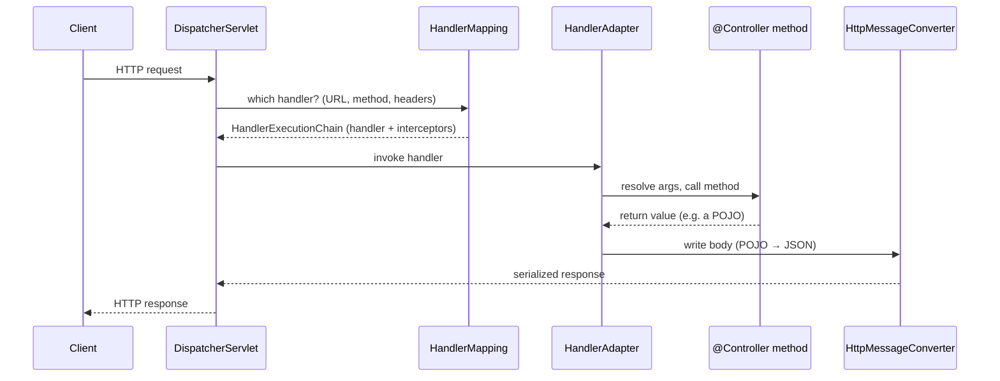

# The Visual Layer — Graphics & Animations

> Why this track is built to be *seen*, the two media it uses, the conventions every visual
> follows, and the full catalog of planned animations. [← back to the index](README.md)

## Why animate Spring at all

Spring's hard parts are almost never a *thing* — they're a **process that unfolds over time**, and
time is exactly what a paragraph or a static diagram can't show. Spring even reads as static: it's a
container, a graph of beans, a pile of annotations. But everything that confuses people about it is
motion. Consider:

- **The bean lifecycle** is an *ordered sequence* — instantiate, inject, `*Aware` callbacks,
  `BeanPostProcessor.postProcessBeforeInitialization`, `@PostConstruct`, `afterPropertiesSet`, the
  init method, `postProcessAfterInitialization` (where the **AOP proxy is born**), then in-use, then
  destroy. The order *is* the lesson; a labelled box loses it.
- **`AbstractApplicationContext.refresh()`** is the entire container booting in a fixed twelve-step
  pipeline — and the embedded web server starts *inside it*, at `onRefresh()`. You don't understand
  Boot startup until you've watched the steps fire in order.
- **A request through the `DispatcherServlet`** is a packet moving: front controller →
  `HandlerMapping` → `HandlerAdapter` → your method → `HttpMessageConverter` → response. A still
  picture of the arrows is a maze; watching one request *travel* it is obvious.
- **An AOP proxy call** is a *redirection in flight* — the caller thinks it's hitting the target,
  but the call lands on a CGLIB subclass, runs advice, *then* delegates. And the classic trap —
  **self-invocation** — is precisely a call that *doesn't* leave the object, so it never touches the
  proxy and `@Transactional`/`@Async` silently does nothing. You have to see the call *not* leave.
- **A transaction** is begin → method body → commit *or* rollback, with `REQUIRES_NEW` opening a
  *second* transaction nested inside the first. The control flow is the whole point.
- **The Security filter chain** is a request being *passed down an ordered list of filters*, each
  with a veto — an unauthenticated request short-circuits halfway and never reaches your controller.
- **Reactive backpressure** is *demand signalling*: the consumer tells the producer how many items
  it can take, and the producer waits. The entire reason WebFlux exists is invisible in a diagram of
  boxes.
- **A circular dependency** resolving is the **three-level cache** handing out a half-built bean
  through `singletonFactories` so a setter cycle can close — while a constructor cycle has nothing to
  hand out and blows up with `BeanCurrentlyInCreationException`. That's an animation, not a sentence.

So: anything that *moves* in Spring gets something that *moves* on the page. That's the whole
philosophy — not eye-candy, but choosing the medium that matches the mechanism. It's the Spring
analog of the java track's rule "if you can measure it, measure it": here the move is **make the
invisible visible** — `--debug` and the `ConditionEvaluationReport`, the Actuator `/beans`,
`/conditions`, `/mappings`, `/configprops` endpoints, transaction and AOP logging, and a breakpoint
in `refresh()` or `TransactionInterceptor`. The animations are the same idea drawn ahead of time.

---

## Two media, by job

### 1. Mermaid — for *structure*
Inline in the markdown chapters, rendered by GitHub and most editors. Use Mermaid for things that
are fundamentally **a fixed shape**: hierarchies, ordered pipelines, state machines, composition.

Good Mermaid candidates: the `@SpringBootApplication` composition (it's *three* meta-annotations),
the `refresh()` twelve-step sequence, the servlet-vs-reactive stack side by side, transaction
propagation as a state/flow, the test-slice family tree, the bean lifecycle as an ordered pipeline,
the `SpringApplication.run()` sequence, and the framework's evolution timeline.

*(A taste — the real version, with the interceptor pre/post hooks and the `@ControllerAdvice` error
path, lives in Part 3 · [16 · Spring MVC Internals: the DispatcherServlet](03-web-mvc-and-reactive/).)*

### 2. Standalone interactive HTML — for *dynamics*
One self-contained `.html` file per animation, living in the relevant part's `visualizations/`
folder. These are for things you need to **play, pause, step, and scrub**: the actual motion of a
container refresh, a request flowing through the dispatcher, a transaction committing, demand
flowing back up a `Flux`.

**Hard rules for every HTML visualization** (so they stay drop-in and never rot):

- **Self-contained.** One file. All CSS and JS inline. **No build step, no dependencies, no
  network, no CDN.** It must work by double-clicking it, offline, in five years.
- **Vanilla only.** Plain HTML + CSS + JS, with `<canvas>` or inline SVG for the graphics. No
  frameworks, no `npm`, no Mermaid-at-runtime.
- **Driven by controls, not a clock.** Every animation has **Play / Pause / Step / Reset** and a
  scrubber. The learner controls time — *stepping one lifecycle phase or one refresh stage at a
  time* is where understanding happens. Auto-play is opt-in, never the only mode.
- **A "what to notice" caption.** Each visualization states, in one or two sentences, the single
  thing the motion is meant to reveal — so it teaches rather than just dazzles.
- **Honest, not magical.** Annotate with the real terms (`postProcessAfterInitialization`,
  `singletonFactories`, `@ConditionalOnMissingBean`, `TransactionInterceptor`, `Mono`/`Flux`,
  `SecurityFilterChain`) so the picture maps directly onto the prose and the Spring source.
- **Consistent look.** Dark background (terminal-friendly), a shared palette (one color for the
  active/in-flight thing, one for "created/ready," one for "proxy/advice," one for
  "blocked/rejected/rolled-back," one for "cached/early reference"), and a link back to the chapter
  that explains it.

> A lightweight shared stylesheet/JS scaffold (`visualizations/_shared/`) will be added with the
> first animation so they all look and behave alike — shared dark theme, palette, and the
> Play/Pause/Step/Reset + scrubber control bar — until then each file is fully standalone.

---

## The animation catalog

The marquee animations, by part. This doubles as the **build spec** — each part's
`visualizations/README.md` tracks the status of its own list. (Built alongside the chapters; the
full-scaffold pass reserves the folders and specs them.)

### Part 0 — Foundations: The Container & IoC
- **`bean-lifecycle.html`** — one bean walking the ordered phases: instantiate → populate (DI) →
  `*Aware` → `postProcessBeforeInitialization` → `@PostConstruct` → `afterPropertiesSet` → init
  method → `postProcessAfterInitialization` → in use → `@PreDestroy` → `destroy`. *Notice: the
  AOP/proxy hook is a `BeanPostProcessor` firing late — usually in `postProcessAfterInitialization` —
  so what you get back is not the raw bean.*
- **`circular-dependency.html`** — two singletons with a setter cycle resolving through the
  three-level cache (`singletonObjects` / `earlySingletonObjects` / `singletonFactories`), then the
  *same* cycle done with constructor injection failing with `BeanCurrentlyInCreationException`.
  *Notice: the early reference handed out of `singletonFactories` is what closes a setter cycle —
  and why a constructor cycle has nothing to hand out (and is prohibited by default since Boot 2.6).*
- **`di-resolution.html`** — an `@Autowired` injection point resolving *by type*, finding multiple
  candidates, and tie-breaking with `@Primary`, then `@Qualifier`. *Notice: injection is type-first;
  the qualifiers exist only to disambiguate when the type alone is ambiguous.*

### Part 1 — The Extension Model & AOP
- **`proxy-interception.html`** — a call routed through a proxy (CGLIB subclass by default in Boot,
  or a JDK dynamic proxy for an interface) to the target, with advice running *before* and *after*;
  then the killer frame: a **self-invocation** call staying inside the object and **bypassing the
  proxy entirely**. *Notice: `@Transactional`/`@Async` ride the proxy, so a call that never leaves
  the bean silently gets no advice — the single most common Spring bug.*
- **`bpp-pipeline.html`** — freshly created beans flowing through the `BeanPostProcessor` chain,
  with one BPP wrapping a target in a proxy on the way out. *Notice: proxies aren't magic — they're a
  `BeanPostProcessor` swapping your bean for a wrapper during initialization.*

### Part 2 — Spring Boot Core
- **`autoconfig-conditions.html`** — a list of candidate auto-configurations (loaded from
  `META-INF/spring/org.springframework.boot.autoconfigure.AutoConfiguration.imports`) evaluated
  against their `@Conditional` gates: `@ConditionalOnClass` passing/failing, `@ConditionalOnProperty`
  checked, and a user `@Bean` causing `@ConditionalOnMissingBean` to *back off* the default. *Notice:
  auto-config is just conditional `@Configuration` — your bean wins because the default is guarded by
  `@ConditionalOnMissingBean`. This is the `ConditionEvaluationReport` drawn live.*
- **`springapplication-run.html`** — the `SpringApplication.run()` sequence step by step: deduce web
  application type → fire `SpringApplicationRunListeners` (starting) → prepare `Environment` → print
  banner → create the `ApplicationContext` → `prepareContext` → `refreshContext` → `afterRefresh` →
  call `ApplicationRunner`/`CommandLineRunner`. *Notice: the embedded server boots **inside**
  `refreshContext` — specifically at `onRefresh()` in `refresh()` — not as a separate step.*

### Part 3 — Web: MVC, REST & Reactive
- **`dispatcherservlet-flow.html`** — one request travelling the servlet front-controller path:
  `DispatcherServlet` → `HandlerMapping` (find handler) → `HandlerAdapter` (invoke) → handler
  method, args bound by `HandlerMethodArgumentResolver`, body written by an `HttpMessageConverter`,
  then the response back out — with the `HandlerInterceptor` pre/post hooks visible. *Notice: there
  is exactly **one** front controller; everything else is a strategy it consults.*
- **`reactive-backpressure.html`** — a `Flux` producer and a slow consumer with **demand signalling**
  (`request(n)`) flowing *back up* the chain, side by side with a blocking thread-per-request pull
  for contrast. *Notice: the consumer sets the pace by requesting demand — that backpressure is the
  whole reason to reach for reactive, and it's not a free speedup.*

### Part 4 — Data & Transactions
- **`transaction-proxy.html`** — a proxied call: `TransactionInterceptor` *begins* a transaction →
  method body runs → *commit* on normal return, *rollback* on a `RuntimeException` (not a checked
  exception, by default); then a **self-invocation** call skipping the transaction; then a
  `REQUIRES_NEW` inner call opening a second, independent transaction nested inside the first.
  *Notice: the proxy is where begin/commit/rollback live — so self-invocation gets no transaction,
  and `REQUIRES_NEW` really does suspend the outer one.*
- **`persistence-context.html`** — entities entering the persistence context (the L1 cache, scoped
  to the `EntityManager`/transaction), **dirty checking** detecting a changed field, the **flush on
  commit**, and a **lazy-load proxy** hit firing an extra query — multiplied into the **N+1 problem**
  across a collection. *Notice: you never called `save()` — dirty checking flushed the change on
  commit — and the lazy proxy is what turns one query into N+1.*

### Part 5 — Production: Security, Observability, Testing, Deployment
- **`security-filter-chain.html`** — a request traversing the ordered `SecurityFilterChain` (the
  servlet `Filter` list behind `FilterChainProxy`, bridged in by `DelegatingFilterProxy`):
  authentication populating the `SecurityContext`, authorization checking, and an **unauthenticated**
  request **short-circuiting** before it ever reaches the controller. *Notice: security is a chain of
  filters with vetoes that runs **before** your `DispatcherServlet` — and Spring Security 6 has no
  `WebSecurityConfigurerAdapter`; the chain is a `@Bean`.*
- **`executable-jar.html`** — the **nested** jar-of-jars layout (`BOOT-INF/classes/`,
  `BOOT-INF/lib/*.jar`) with `org.springframework.boot.loader`'s `JarLauncher` reading nested jars
  without unpacking, and `layers.idx` grouping content for Docker cache reuse. *Notice: it's **not**
  a shaded/uber jar — classes aren't flattened; a custom launcher loads jars-within-the-jar.*

### Part 6 — Principal Skills
- **`startup-cost-breakdown.html`** — a stacked timeline of where Boot startup time actually goes —
  classpath scanning, condition evaluation / auto-configuration, bean instantiation, embedded server
  start — and the *same* app under AOT/native image, where most of that work has moved to **build
  time** and the runtime bar nearly vanishes. *Notice: AOT/native doesn't make the work cheaper, it
  moves it earlier — the runtime startup collapses but the build gets heavier and you lose JIT peak.*
  Ties straight to the java track's [`startup-vs-peak.html`](../java/VISUALIZATIONS.md) and Part 5 ·
  28 · Boot 3 AOT & GraalVM Native Image.

> The two remaining "Part 6" visuals are deliberately *not* HTML. The **framework evolution
> timeline** (Spring → Spring Boot → reactive → Boot 3/Jakarta/AOT) is a fixed shape — a Mermaid
> timeline reads better than an animation. And the **"do I need Spring here?" decision** (30 ·
> Architecture with Spring & Knowing When Not To) is a judgment tree — an inline Mermaid `flowchart`
> of the forces beats motion. Reach for HTML only when something genuinely *moves*.

---

## How visuals are referenced from the chapters

Each chapter embeds its Mermaid inline and links its HTML animation with a one-line callout, e.g.:

> ▶ **Watch it:** [`bean-lifecycle.html`](00-foundations-the-container/visualizations/bean-lifecycle.html) —
> step one bean through every phase and watch the AOP proxy get swapped in at
> `postProcessAfterInitialization`, so the reference you receive is the wrapper, not the raw bean.

So the prose carries the precise explanation, Mermaid carries the structure, and the HTML carries
the motion — three views of the same idea, which is exactly how something hard becomes obvious.
